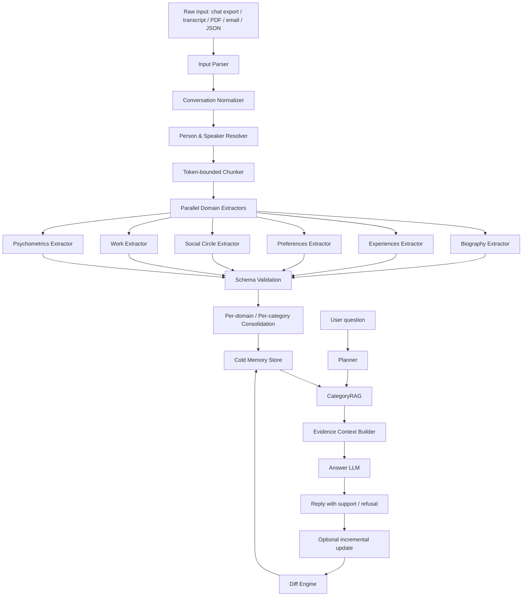
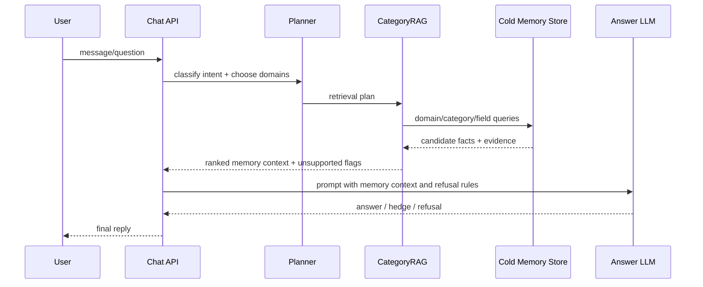
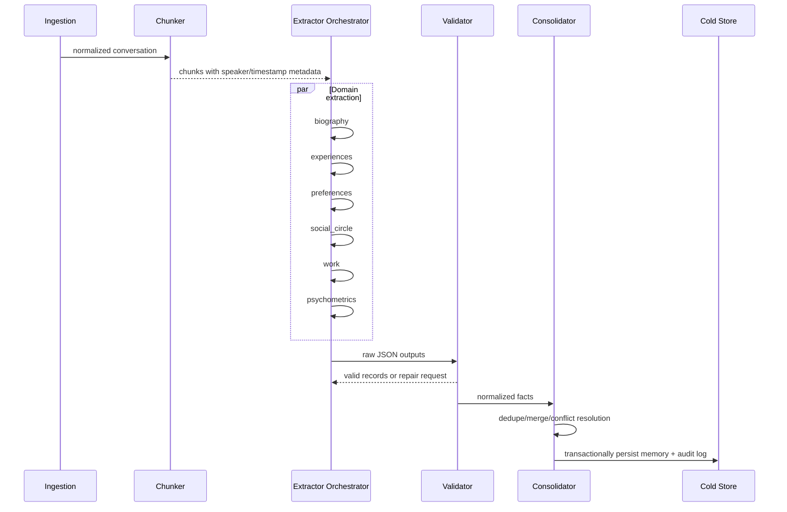
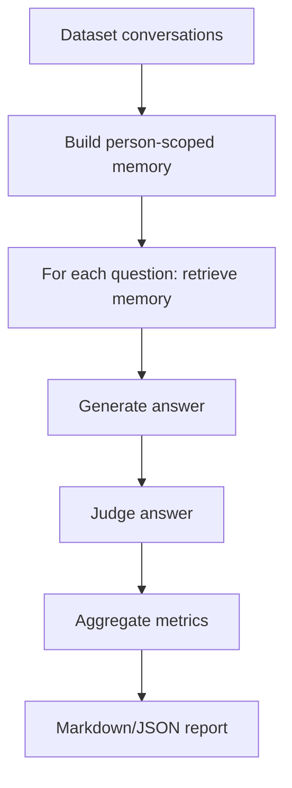

# EXECUTION_BRIEF для агента-программиста: Synthius-Mem MVP vertical slice

**Версия:** 1.1-agent-ready  
**Назначение:** короткая управляющая рамка поверх полной мастер-спеки `synthius_mem_programmer_spec.md`.  
**Правило приоритета:** если этот brief конфликтует с полной мастер-спекой, агент-программист обязан следовать этому brief в рамках текущей итерации. Полная мастер-спека остается архитектурным reference-документом и backlog’ом.

---

## 1. Главный вердикт по scope

Полная мастер-спека хороша как `SPEC_FULL.md`, но слишком широка как единственный prompt для автономного coding agent’а. В текущей итерации агент должен реализовать **не всю платформу**, а **один законченный end-to-end vertical slice**.

Текущая цель: **P0a — доказать core memory loop**:

```text
JSON/plaintext conversation
-> speaker/person resolution
-> token-bounded chunking
-> extraction candidates for 3 core domains
-> validation
-> candidate fact lifecycle
-> consolidation into active memory
-> evidence-backed CategoryRAG retrieval
-> refusal on unsupported premise
-> minimal chat endpoint + CLI
-> small golden eval report
```

Все остальное из полной мастер-спеки считать backlog’ом, если оно не нужно для этого flow.

---

## 2. Нельзя нарушать: 5 архитектурных инвариантов

1. **Person-scoped memory.** Каждый memory fact принадлежит ровно одному `person_id`. Retrieval не имеет права смешивать факты разных людей, если это явно не запрошено и не авторизовано.
2. **Structured memory is the source of truth.** Главный источник ответа — `active` structured facts, а не raw conversation chunks и не flat vector RAG.
3. **Evidence-first.** Active fact без evidence запрещен. Любой факт, который может попасть в answer context, должен иметь ссылку на source segment/message и compact quote/evidence summary.
4. **Absence-aware refusal.** Если memory retrieval не нашел evidence для личного утверждения, система должна отказаться или захеджировать, а не угадывать.
5. **Candidate facts are not truth-store.** Факты после extraction не становятся активными автоматически. Они проходят state machine: candidate -> validation -> consolidation -> active/rejected/needs_review.

---

## 3. P0a: что реализовать сейчас

### 3.1. In scope P0a

Агент должен реализовать только следующие блоки:

1. **Repo / local infra**
   - FastAPI app или эквивалентный HTTP service.
   - PostgreSQL через Docker Compose.
   - Alembic migrations или иной migration layer.
   - Pydantic/Zod schemas.
   - pytest/unit tests.
   - mock LLM provider для CI и deterministic fixtures.
   - OpenAI-compatible LLM provider interface, но реальные ключи не требуются для тестов.

2. **Input support**
   - `json` conversation format.
   - `plaintext` chat transcript with speaker labels.
   - Non-conversational PDF/email/Telegram/WhatsApp parsers НЕ делать в P0a.

3. **Normalized source model**
   - Поддержать разговоры как messages.
   - Сразу заложить общий слой `source_documents` / `source_segments`, чтобы позже не ломать модель под PDF/email.
   - Для P0a `message` является частным случаем `source_segment`.

4. **Person and speaker resolution**
   - Создание `persons`.
   - Явное маппирование raw speaker label -> `person_id`.
   - Если speaker не resolved, facts о нем не могут стать `active`.

5. **Chunking**
   - Token-bounded chunks.
   - Preserve message boundaries.
   - Chunk должен хранить ссылки на source segments/messages.

6. **Extraction for 3 domains only**
   - `Biography`.
   - `Preferences`.
   - `Work`.
   - `Experiences` и `Social Circle` — P0b.
   - `Psychometrics` — stub only, выключен по умолчанию.

7. **Candidate fact lifecycle**
   - Отдельная таблица/слой для extracted candidates или явный статусный контракт в `memory_facts`.
   - Active facts появляются только после validation + consolidation.

8. **Consolidation**
   - Dedupe by canonical key.
   - Merge evidence.
   - Basic conflict handling.
   - Current-state facts can supersede older facts.

9. **Retrieval / CategoryRAG**
   - Deterministic router first; LLM planner optional.
   - Retrieval по `person_id`, `domain`, `category`, keyword/field match.
   - Context builder возвращает только active facts with evidence.

10. **Answer/refusal**
    - Minimal `/chat` endpoint или CLI chat command.
    - If evidence is absent for a personal claim, answer must refuse/hedge.
    - Answer must not use candidate/needs_review/rejected facts.

11. **Golden eval**
    - Минимум 20–50 тестовых вопросов на fixture conversation.
    - Обязательные группы: supported fact, unsupported premise, cross-person contamination, temporal/basic update.
    - Вывести JSON/Markdown report: accuracy, refusal correctness, evidence coverage, token estimate, retrieval latency.

### 3.2. Out of scope P0a

Агент НЕ должен тратить время на это до завершения P0a:

- PDF parser.
- Email parser.
- WhatsApp/Telegram parser.
- Full auth matrix.
- Admin UI/review dashboard.
- Full tenant billing / production RBAC.
- Psychometrics beyond stub.
- Style domain.
- MCP server.
- Vector DB.
- Distributed Celery/Redis workers, если простого background job достаточно.
- Complex observability dashboards.
- Large-scale load tests.
- Production deployment hardening.

---

## 4. P0b: следующий слой после working P0a

P0b начинать только когда P0a e2e flow работает и тесты проходят.

P0b включает:

1. `Experiences` domain.
2. `Social Circle` domain.
3. Incremental update from new conversation turns.
4. Rollback for memory operations.
5. Better conflict handling.
6. LLM planner optional path.
7. Larger golden eval set.
8. Basic API auth placeholder.
9. Additional parsers only after core memory loop stable.

---

## 5. Fact lifecycle state machine

### 5.1. States

```text
extracted_candidate
  -> invalid_rejected
  -> validated_candidate
      -> active
      -> needs_review
      -> rejected
active
  -> superseded
  -> deleted
  -> needs_review
needs_review
  -> active
  -> rejected
superseded
  -> restored
  -> deleted
deleted
  -> restored
```

### 5.2. State definitions

| State | Meaning | Can be used in answers? |
|---|---|---:|
| `extracted_candidate` | Raw LLM extraction before validation. | No |
| `validated_candidate` | Parsed and schema-valid, not yet consolidated. | No |
| `active` | Published truth-store fact with evidence. | Yes |
| `needs_review` | Ambiguous, conflicting, unresolved speaker/person, or low confidence. | No by default |
| `rejected` | Invalid or unsupported candidate. | No |
| `superseded` | Older fact replaced by newer fact but kept for history. | Only if historical query explicitly needs it |
| `deleted` | Removed by user/admin/system policy. | No |
| `restored` | Re-activated from deleted/superseded path. | Yes if restored to active |

### 5.3. Promotion rules

A candidate may become `active` only if all conditions are true:

1. `person_id` resolved.
2. domain payload schema valid.
3. `canonical_key` generated.
4. at least one evidence record attached.
5. confidence >= configured threshold.
6. no unresolved hard conflict with existing active fact.
7. source segment/message exists and belongs to same tenant.

If any condition fails, candidate becomes `needs_review` or `rejected`, never `active`.

---

## 6. Data model amendments for agent implementation

### 6.1. Add generic source layer

Do not model every input as conversation-only. Implement this minimal abstraction:

```text
source_documents
- id
- tenant_id
- source_type: json_chat | plaintext_chat | pdf | email | api | other
- source_name
- source_hash
- metadata
- created_at

source_segments
- id
- tenant_id
- source_document_id
- conversation_id nullable
- message_id nullable
- segment_type: message | paragraph | email_part | pdf_page_span | note
- speaker_person_id nullable
- speaker_raw nullable
- timestamp nullable
- sequence_index
- content
- content_hash
- metadata
```

For P0a:

- `messages` can exist as a convenience table.
- Every message must also be addressable as a `source_segment` or have equivalent segment-level provenance.
- Evidence should point to `source_segment_ids`, not only to conversation/message ids.

### 6.2. Candidate storage

Either implement a separate table:

```text
memory_fact_candidates
- id
- tenant_id
- person_id nullable
- domain
- category
- canonical_key nullable
- payload
- summary
- candidate_status
- validation_errors
- confidence
- source_kind
- extraction_job_id
- source_segment_ids
- created_at
```

or use `memory_facts.status = extracted_candidate/validated_candidate/...`.

Preferred for clarity: separate `memory_fact_candidates` table in P0a, then publish into `memory_facts` only when active/superseded/deleted lifecycle starts.

---

## 7. API contract amendments

Every user-facing request must include actor/viewer context, even if P0a uses a simple dev auth stub.

### 7.1. Required actor context

```json
{
  "actor": {
    "actor_id": "dev-user-1",
    "actor_type": "owner|admin|service|support|eval",
    "tenant_id": "uuid",
    "allowed_person_ids": ["uuid"],
    "allowed_domains": ["biography", "preferences", "work"],
    "can_view_sensitive": false
  }
}
```

### 7.2. Chat request shape

```json
{
  "tenant_id": "uuid",
  "person_id": "uuid",
  "actor": {
    "actor_id": "dev-user-1",
    "actor_type": "owner",
    "allowed_person_ids": ["uuid"],
    "allowed_domains": ["biography", "preferences", "work"],
    "can_view_sensitive": false
  },
  "message": "What pets do I have?",
  "options": {
    "include_memory_trace": false,
    "update_memory_from_turn": false
  }
}
```

P0a may implement authorization as simple assertions/checks, not full auth. But API shape must not omit actor context.

---

## 8. Concurrency and update semantics

P0a implementation must be deterministic and safe under repeated runs.

### 8.1. Locking

- Only one build/update job may publish memory changes for the same `(tenant_id, person_id)` at a time.
- Preferred P0a implementation: PostgreSQL advisory lock or row-level lock on `person_memory_versions`.
- Extraction may run in parallel, but publish/consolidation must be serialized per person.

### 8.2. Idempotency

- Import idempotency by `source_hash`.
- Chunk idempotency by `(source_document_id, chunk_config_hash, start_segment_id, end_segment_id)`.
- Candidate idempotency by `(extraction_job_id, domain, canonical_key, source_segment_ids_hash)`.
- Active fact idempotency by `(tenant_id, person_id, domain, canonical_key, normalized_payload_hash)`.

### 8.3. Safe reprocessing

Re-running build on the same source must not duplicate active facts. It may:

- merge evidence into existing active facts;
- increase confidence;
- create a new superseding fact only if normalized payload actually differs;
- mark unresolved conflicts as `needs_review`.

---

## 9. P0a binary acceptance gates

P0a is done only when all of these are true:

1. `docker compose up` starts DB + API.
2. Migrations apply from empty DB.
3. JSON fixture conversation imports.
4. Plaintext fixture conversation imports.
5. Speakers can be mapped to at least two persons.
6. Chunks are created and preserve source segment references.
7. Mock LLM extraction produces candidates for Biography, Preferences, Work.
8. Invalid extraction output is rejected or marked `needs_review`.
9. Valid candidates with evidence can be consolidated into active facts.
10. Duplicate candidates merge evidence instead of duplicating facts.
11. Conflicting current-state facts supersede or go to `needs_review`.
12. CategoryRAG retrieves active facts for the correct person only.
13. Cross-person contamination test passes.
14. `/chat` or CLI answers supported questions using evidence-backed memory.
15. `/chat` or CLI refuses false-premise questions.
16. Candidate/needs_review/rejected facts never appear in normal answer context.
17. Golden eval report is generated.
18. Unit/integration tests pass.
19. Token usage and retrieval latency are logged at least roughly.
20. `IMPLEMENTATION_NOTES.md` lists any deviations from the full spec.

---

## 10. Suggested implementation order for the coding agent

Use this exact order unless blocked:

1. Repo skeleton + Docker Compose + DB migration system.
2. Core tables: tenants/persons/source_documents/source_segments/messages/chunks.
3. Import JSON/plaintext fixtures.
4. Speaker resolver.
5. Chunker.
6. Domain schemas for Biography, Preferences, Work.
7. Candidate table + fact lifecycle enums.
8. Mock LLM provider and fixture extractor output.
9. Extraction orchestrator to candidates.
10. Validation and canonical key generation.
11. Publish/consolidation into active memory.
12. Evidence linking.
13. Deterministic CategoryRAG retrieval.
14. Context builder.
15. Minimal chat/refusal logic.
16. Golden eval harness.
17. Real LLM provider adapter.
18. Improve tests and docs.

Do not start PDF/email/parsers/auth/UI/psychometrics before step 16 is green.

---

## 11. Minimal test fixture requirements

Create at least one synthetic conversation with two participants where:

- Person A states name/location/job/preferences.
- Person B states different name/location/job/preferences.
- There is at least one changed fact: old city/job/preference -> new city/job/preference.
- There is at least one false premise question.
- There is at least one cross-person trap: question about A using B’s fact.
- There is at least one unsupported personal question.

Example required eval rows:

```json
[
  {
    "question": "Where does Alice live now?",
    "target_person": "alice",
    "expected_behavior": "answer_supported",
    "required_fact_key": "biography.residence.current"
  },
  {
    "question": "When did Alice move to Tokyo?",
    "target_person": "alice",
    "expected_behavior": "refuse_or_hedge_if_not_disclosed"
  },
  {
    "question": "Does Alice like hiking?",
    "target_person": "alice",
    "expected_behavior": "must_not_use_bob_preference"
  }
]
```

---

## 12. Practical instruction for prompt usage

When giving the job to a programmer-agent, provide files in this order:

1. `synthius_mem_execution_brief.md` — authoritative current iteration scope.
2. `synthius_mem_programmer_spec.md` — full architecture/reference/backlog.
3. Source paper PDF — conceptual reference only, not a request to reproduce benchmark claims.

Opening instruction to the coding agent:

```text
Implement P0a only. Treat EXECUTION_BRIEF as higher priority than SPEC_FULL. Use SPEC_FULL as reference for architecture and future phases. Do not implement P0b/P1/P2 until all P0a acceptance gates pass. If you must choose between completeness and a working evidence-backed memory loop, choose the working vertical slice.
```


---

# SPEC_FULL_REFERENCE: полная мастер-спека v1.0

> Ниже расположен исходный полный документ. В текущей итерации `EXECUTION_BRIEF` выше имеет приоритет над этим reference-разделом.

# Техническое задание для агента-программиста: structured persona memory system по мотивам Synthius-Mem

**Версия:** 1.0  
**Формат:** Markdown / инженерное ТЗ  
**Язык реализации:** определяется командой, рекомендуемый стек указан ниже  
**Источник требований:** работа `Synthius-Mem: Brain-Inspired Hallucination-Resistant Persona Memory Achieving 94.4% Memory Accuracy and 99.6% Adversarial Robustness on LoCoMo`, апрель 2026.  
**Целевая система:** подсистема долговременной персональной памяти для LLM-агентов, которая извлекает, консолидирует, хранит, обновляет и извлекает структурированные знания о конкретном человеке, а не просто ретранслирует историю диалога.

---

## 0. Назначение документа

Этот документ должен быть использован как максимально подробное ТЗ для агента-программиста. Задача агента - спроектировать и реализовать production-ready прототип системы долговременной persona-memory, архитектурно близкой к Synthius-Mem:

1. входные разговоры и документы пользователя превращаются в структурированную память;
2. память разделена на специализированные домены;
3. факты хранятся с доказательствами, временными метаданными, уверенностью и историей версий;
4. retrieval работает по доменам и категориям, а не только по embedding similarity;
5. ответы агента должны опираться только на подтвержденную память;
6. если факт не раскрыт пользователем, система должна уметь явно отказаться отвечать, а не галлюцинировать.

Документ намеренно детализирован. Если агент-программист видит противоречие между двумя требованиями, он обязан:

- сначала выполнить требования с приоритетом `P0`;
- затем требования `P1`;
- затем `P2` и `P3`;
- не скрывать спорные места, а фиксировать их в `IMPLEMENTATION_NOTES.md` или в issue-трекере;
- не заменять структурированную память плоским RAG, если это прямо не указано как временный fallback.

---

## 1. Краткое описание исходной работы и что нужно реализовать

В работе описана система Synthius-Mem - структурированная persona-memory для AI-агентов. Главная идея: вместо поиска по сырым кускам диалога система извлекает то, что **известно о человеке**, и хранит это в шести специализированных когнитивных доменах:

1. `Biography` - биографические факты и семантическое self-knowledge.
2. `Experiences` - эпизодические воспоминания, события, переживания, контекст и эмоции.
3. `Preferences` - предпочтения, ценности, likes/dislikes, оценочные суждения.
4. `Social Circle` - люди вокруг пользователя, отношения, доверие, близость, динамика.
5. `Work` - профессиональный контекст, роли, проекты, навыки, инструменты, результаты.
6. `Psychometrics` - психологический профиль по нескольким фреймворкам.

В работе также упоминается отдельный `Style Domain`: он не является queryable memory, но используется как fingerprint письменного/коммуникационного стиля для генерации ответов в согласованной манере. В MVP его можно реализовать как P2/P3 модуль.

Ключевые архитектурные элементы, которые нужно отразить в реализации:

- input parsing разных форматов;
- token-bounded chunking с overlap;
- параллельная LLM-экстракция по 6 доменам;
- JSON-схемы для каждого домена;
- per-category consolidation: дедупликация, merge, conflict resolution;
- cold memory store со структурированными JSON-записями;
- CategoryRAG: retrieval по доменам/категориям/полям;
- planner LLM, который выбирает, какие домены запрашивать;
- answer LLM, который получает только релевантную структурированную память;
- reversible diff engine для add/edit/delete/rollback;
- adversarial robustness: refusal/hedge при неподтвержденных false-premise вопросах;
- benchmark/evaluation harness, включая LoCoMo-style QA, LLM-as-judge, метрики по категориям.

---

## 2. Главная продуктовая цель

Создать систему долговременной персональной памяти для LLM-агента, которая:

1. **Строит отдельную persona для каждого участника разговора.**  
   Если в диалоге два человека, память не должна смешивать факты одного человека с фактами другого.

2. **Хранит знания о человеке в типизированных доменах.**  
   Нельзя хранить все как один список строк или как единственный vector index. Vector retrieval может использоваться как вспомогательный механизм, но не как главный источник истины.

3. **Сохраняет provenance каждого факта.**  
   У каждого факта должно быть доказательство: source document / conversation id / session id / message ids / quote или compact evidence span.

4. **Разрешает конфликты и обновляет память.**  
   Например, если пользователь раньше жил в Москве, а теперь сказал, что переехал в Берлин, система должна сохранить историю и актуальный статус.

5. **Отвечает только на основании attested facts.**  
   Если пользователь не раскрывал факт, система должна сказать, что в памяти нет подтверждения. Это критичнее, чем попытаться угадать.

6. **Снижает token cost относительно full-context replay.**  
   На длинных разговорах система не должна подставлять весь raw history в каждый prompt.

7. **Обеспечивает измеримость.**  
   Нужны автоматические тесты, benchmark harness, latency metrics, token accounting и отчеты по качеству.

---

## 3. Принципы проектирования

### 3.1. Domain-structured storage

Память должна быть разделена на домены. Каждый домен имеет:

- отдельную JSON-схему;
- отдельный extractor prompt;
- отдельные правила валидации;
- отдельные правила консолидации;
- отдельный retrieval tool;
- отдельные unit/integration tests;
- отдельные метрики качества.

Запрещено в P0/P1 реализации сводить все домены к одному универсальному `facts: string[]` без типизации.

### 3.2. Active consolidation

Система не должна просто append-ить новые факты. После extraction нужно выполнять консолидацию:

- дедупликация;
- merge близких фактов;
- resolution конфликтов;
- temporal ordering;
- assignment актуальности;
- сохранение старых версий;
- привязка к evidence.

Консолидация должна выполняться **per upper category within each domain**, чтобы, например, education facts не смешивались с health facts.

### 3.3. Bounded processing

Система должна уметь обрабатывать длинные истории через token-bounded chunks. Нельзя рассчитывать, что вся история всегда помещается в один context window.

### 3.4. Absence-aware answering

Важнейшее отличие от обычного RAG: если memory retrieval не нашел подтверждения, это не повод искать похожие куски и выдумывать ответ. Absence of evidence должен быть machine-readable signal для refusal.

### 3.5. Person-scoped memory

Все факты должны быть привязаны к конкретному `person_id`. Для диалогов с двумя участниками нужно строить две отдельные persona. Cross-person contamination считается критическим багом.

### 3.6. Evidence-first design

Каждый факт, score или inference должен иметь один из статусов:

- `explicit` - явно сказано пользователем или собеседником о пользователе;
- `inferred` - вывод на основании нескольких фактов;
- `derived` - вычисленное значение, например duration;
- `user_corrected` - исправлено пользователем;
- `system_generated_low_confidence` - низкоуверенная гипотеза, не использовать для ответов без hedge.

По умолчанию answer generation может использовать только `explicit`, `user_corrected`, `derived` и осторожно `inferred`, если confidence >= заданного порога.

---

## 4. Термины и сущности

### 4.1. Основные термины

| Термин | Значение |
|---|---|
| `Persona` | Структурированная модель конкретного человека. |
| `Person` | Участник диалога или пользователь, для которого строится память. |
| `Conversation` | Один импортированный корпус коммуникации: чат, email-thread, transcript и т.д. |
| `Session` | Логический блок conversation, обычно с общей датой/периодом. |
| `Turn` | Один utterance/message с speaker, timestamp и content. |
| `Chunk` | Token-bounded сегмент conversation для extraction. |
| `Fact` | Атомарная или структурированная единица памяти. |
| `Evidence` | Ссылка на исходные сообщения и короткая цитата/summary, подтверждающая факт. |
| `Cold Memory` | Основное долговременное хранилище структурированной памяти. |
| `Working Context` | Контекст, который подается answer LLM для конкретного запроса. |
| `CategoryRAG` | Retrieval по доменам, категориям и структурированным полям. |
| `Planner` | LLM или deterministic router, выбирающий домены и retrieval plan. |
| `Consolidation` | Процесс dedupe/merge/conflict resolution/update. |
| `Diff` | Реверсивное изменение памяти: add/edit/delete с rollback. |

### 4.2. Приоритеты требований

| Приоритет | Значение |
|---|---|
| `P0` | Критично для MVP. Без этого система не считается реализованной. |
| `P1` | Нужно для production-like качества. Желательно реализовать сразу после P0. |
| `P2` | Расширение качества, аналитики и полноты. Можно делать после стабильного P1. |
| `P3` | Future work / advanced features. Не блокирует запуск. |

### 4.3. Уровни обязательности

| Метка | Интерпретация |
|---|---|
| `MUST` | Обязательно. Нельзя выпускать без этого. |
| `SHOULD` | Нужно сделать, если нет сильной причины отложить. |
| `COULD` | Полезно, но не критично. |
| `WON'T` | Не входит в текущий scope. |

---

## 5. Scope и non-scope

### 5.1. In scope

В рамках проекта нужно реализовать:

1. ingestion разговоров и документов;
2. нормализацию участников, сообщений, timestamp;
3. chunking;
4. extraction в 6 доменов;
5. schema validation;
6. structured cold memory store;
7. consolidation per domain/per category;
8. person-scoped memory;
9. CategoryRAG retrieval;
10. planner для выбора доменов;
11. answer generation с refusal logic;
12. incremental memory update;
13. diff engine и rollback;
14. audit/provenance;
15. benchmark/eval harness;
16. latency/token accounting;
17. базовые security/privacy меры;
18. API для интеграции с чат-агентом.

### 5.2. Out of scope для P0/P1

Не нужно в P0/P1:

1. fine-tuning моделей;
2. обучение собственного embedding model;
3. полноценная медицинская/психологическая диагностика;
4. multi-agent shared memory с ACL на уровне организаций;
5. federated learning;
6. MCP-сервис как обязательный интерфейс;
7. real-time streaming extraction на каждом токене;
8. сложная UI-панель редактирования памяти;
9. юридически значимое хранение медицинских/финансовых документов без отдельной compliance-проработки;
10. гарантия воспроизведения заявленных в статье метрик без доступа к идентичному коду, prompts, моделям и judge-протоколу.

### 5.3. Non-goals архитектуры

Система **не должна** превращаться в:

- обычный chatbot с summary buffer;
- flat fact extractor без доменов;
- vector-only RAG;
- CRM общего назначения;
- knowledge base обо всем мире;
- систему, которая уверенно угадывает личные факты.

---

## 6. Целевые метрики и критерии приемки

### 6.1. Функциональные метрики качества

| Метрика | MVP target P0 | Production target P1/P2 | Комментарий |
|---|---:|---:|---|
| Core memory fact accuracy | >= 90% на внутреннем golden set | >= 96-98% | Основные биографические/социальные/рабочие факты. |
| Adversarial robustness | >= 95% | >= 99% | False-premise вопросы должны получать refusal/hedge. |
| Temporal precision | >= 80% | >= 92% | Даты, последовательности, длительности. |
| Cross-person contamination | <= 1% | 0 критических случаев | Факты не должны переноситься между участниками. |
| Evidence coverage | >= 95% фактов с evidence | >= 99% | Каждый используемый факт должен иметь provenance. |
| Schema validation pass rate | >= 98% | >= 99.5% | Invalid JSON должен автоматически чиниться или отклоняться. |
| Retrieval relevance | >= 90% | >= 95% | Retrieved facts должны поддерживать вопрос. |
| Refusal correctness | >= 95% | >= 99% | Неизвестное - отказ, а не фантазия. |

### 6.2. Performance metrics

| Метрика | MVP target | Production target | Комментарий |
|---|---:|---:|---|
| CategoryRAG latency p50 | <= 100 ms | <= 30 ms | В статье указан mean 21.79 ms; target production близок к этому. |
| CategoryRAG latency p95 | <= 250 ms | <= 100 ms | Без учета answer LLM. |
| Chat-time extra tokens at N=500 | <= 8k | <= 5.5k | Цель - не full-context replay. |
| Full-context usage | 0 в normal path | 0 | Допустимо только для baseline/eval. |
| Extraction throughput | >= 1 chunk/min локально | зависит от LLM | Не блокирует P0, но нужно логировать. |
| Memory retrieval availability | >= 99% в dev/staging | >= 99.9% prod | Зависит от infra. |

### 6.3. Safety metrics

| Метрика | Target | Комментарий |
|---|---:|---|
| Unsupported personal claim rate | <= 1% | Любое утверждение о пользователе должно иметь evidence. |
| PII leakage in logs | 0 критических инцидентов | Raw text не логировать без redaction. |
| Deletion/rollback success | 100% в тестах | Пользователь должен иметь возможность удалить факт. |
| Data isolation by tenant | 100% | Критично для multi-user deployment. |

### 6.4. Acceptance criteria верхнего уровня

Система считается готовой на уровне P0, если:

1. можно импортировать multi-session conversation;
2. можно построить persona минимум для одного пользователя и второго участника;
3. данные извлекаются минимум в 5 из 6 доменов: Biography, Experiences, Preferences, Social Circle, Work; Psychometrics можно stub/partial;
4. каждый факт хранит evidence;
5. consolidation выполняет dedupe и basic conflict resolution;
6. retrieval выбирает релевантные домены и возвращает structured context;
7. answer generator отказывается отвечать на неподтвержденные личные факты;
8. есть API и CLI для build/update/retrieve/chat/eval;
9. есть автоматические тесты;
10. есть отчет по golden set с accuracy/adversarial/token/latency.

---

## 7. Архитектура высокого уровня

### 7.1. Общий pipeline



### 7.2. Chat-time retrieval flow



### 7.3. Build-time extraction flow



---

## 8. Рекомендуемый технологический стек

Это не жесткое требование, но агент-программист должен выбрать стек и зафиксировать причины выбора.

### 8.1. Backend

Рекомендуется:

- Python 3.11+;
- FastAPI для API;
- Pydantic v2 для схем;
- SQLAlchemy 2.x или SQLModel;
- PostgreSQL 15+;
- JSONB для доменных payloads;
- pg_trgm/full-text search для field-level matching;
- pgvector только как optional auxiliary, не как источник истины;
- Redis для caching/rate limiting/job state;
- Celery/RQ/Arq для async extraction jobs;
- Alembic для migrations;
- OpenTelemetry + structured logs;
- pytest + pytest-asyncio.

Альтернатива допустима: TypeScript/NestJS + Postgres + Zod. Но весь документ ниже описывает сущности языконезависимо.

### 8.2. LLM provider layer

Нужен provider-agnostic adapter:

```text
LLMClient
  - complete_json(prompt, schema, temperature, max_tokens, metadata)
  - complete_text(prompt, temperature, max_tokens, metadata)
  - count_tokens(text_or_messages)
  - estimate_cost(input_tokens, output_tokens, model)
```

Поддержать минимум:

- OpenAI-compatible API;
- local/mock provider для тестов;
- deterministic fixture provider для CI.

### 8.3. Storage

Минимум P0:

- PostgreSQL;
- JSONB schemas;
- индексы по `tenant_id`, `person_id`, `domain`, `category`, `status`, `valid_from`, `valid_to`, `confidence`;
- audit log таблица;
- transactional writes.

P1/P2:

- materialized views для retrieval;
- denormalized search index;
- cache горячих persona summaries;
- encryption at rest/application-level encryption для sensitive fields.

---

## 9. Модульная структура репозитория

Рекомендуемая структура:

```text
repo/
  README.md
  IMPLEMENTATION_NOTES.md
  pyproject.toml
  .env.example
  docker-compose.yml
  alembic.ini

  app/
    main.py
    config.py
    logging.py
    dependencies.py

    api/
      routes_health.py
      routes_ingestion.py
      routes_memory.py
      routes_chat.py
      routes_eval.py
      routes_admin.py

    core/
      ids.py
      time.py
      tokens.py
      errors.py
      security.py
      provenance.py
      scoring.py

    llm/
      client.py
      openai_client.py
      mock_client.py
      prompts/
        extraction_biography.md
        extraction_experiences.md
        extraction_preferences.md
        extraction_social_circle.md
        extraction_work.md
        extraction_psychometrics.md
        planner.md
        answer.md
        judge.md

    ingestion/
      parser_base.py
      parser_plaintext.py
      parser_json.py
      parser_whatsapp.py
      parser_telegram.py
      parser_email.py
      parser_pdf.py
      normalizer.py
      speaker_resolver.py
      chunker.py

    memory/
      domains/
        biography.py
        experiences.py
        preferences.py
        social_circle.py
        work.py
        psychometrics.py
        style.py
      extractors/
        orchestrator.py
        base.py
        biography_extractor.py
        experiences_extractor.py
        preferences_extractor.py
        social_circle_extractor.py
        work_extractor.py
        psychometrics_extractor.py
      consolidation/
        base.py
        dedupe.py
        merge.py
        conflicts.py
        temporal.py
        biography_consolidator.py
        experiences_consolidator.py
        preferences_consolidator.py
        social_circle_consolidator.py
        work_consolidator.py
        psychometrics_consolidator.py
      retrieval/
        planner.py
        category_rag.py
        ranker.py
        context_builder.py
        refusal.py
      updates/
        diff_engine.py
        rollback.py
        incremental.py
      store/
        models.py
        repository.py
        migrations/

    chat/
      service.py
      answer_generator.py
      memory_injection.py
      policies.py

    eval/
      datasets/
      locomo_loader.py
      golden_loader.py
      runner.py
      judge.py
      metrics.py
      reports.py
      baselines/
        full_context.py
        sliding_window.py
        summarization.py
        embedding_rag.py

  tests/
    unit/
    integration/
    e2e/
    fixtures/
    golden/

  scripts/
    build_memory.py
    update_memory.py
    query_memory.py
    run_eval.py
    export_persona.py
    inspect_memory.py
```

---

## 10. Data model: database layer

### 10.1. Таблица `tenants`

Для multi-user deployment.

| Поле | Тип | Обяз. | Описание |
|---|---|---:|---|
| `id` | UUID | yes | Tenant id. |
| `name` | text | yes | Название. |
| `created_at` | timestamptz | yes | Создание. |
| `status` | enum | yes | active/suspended/deleted. |

### 10.2. Таблица `persons`

| Поле | Тип | Обяз. | Описание |
|---|---|---:|---|
| `id` | UUID | yes | Person id. |
| `tenant_id` | UUID | yes | Tenant. |
| `display_name` | text | no | Имя, если известно. |
| `aliases` | text[] | no | Алиасы, nicknames, handles. |
| `person_type` | enum | yes | user/contact/participant/unknown. |
| `primary_user` | bool | yes | Является ли основным пользователем. |
| `metadata` | JSONB | yes | Доп. данные. |
| `created_at` | timestamptz | yes | Создание. |
| `updated_at` | timestamptz | yes | Обновление. |

Индексы:

- `(tenant_id, id)`;
- GIN по `aliases`;
- trigram index по `display_name`.

### 10.3. Таблица `conversations`

| Поле | Тип | Обяз. | Описание |
|---|---|---:|---|
| `id` | UUID | yes | Conversation id. |
| `tenant_id` | UUID | yes | Tenant. |
| `source_type` | enum | yes | whatsapp/telegram/email/pdf/plaintext/json/api. |
| `source_name` | text | no | File name/source label. |
| `source_hash` | text | yes | Hash raw source для idempotency. |
| `started_at` | timestamptz | no | Начало. |
| `ended_at` | timestamptz | no | Конец. |
| `metadata` | JSONB | yes | Parser metadata. |
| `created_at` | timestamptz | yes | Создание. |

### 10.4. Таблица `messages`

| Поле | Тип | Обяз. | Описание |
|---|---|---:|---|
| `id` | UUID | yes | Message id. |
| `tenant_id` | UUID | yes | Tenant. |
| `conversation_id` | UUID | yes | Conversation. |
| `session_id` | UUID | no | Session. |
| `speaker_person_id` | UUID | no | Resolved speaker. |
| `speaker_raw` | text | no | Raw speaker label. |
| `timestamp` | timestamptz | no | Timestamp. |
| `sequence_index` | int | yes | Order in conversation. |
| `content` | text | yes | Normalized content. |
| `content_hash` | text | yes | Hash. |
| `language` | text | no | ISO language code. |
| `metadata` | JSONB | yes | Attachments, parser notes. |

Индексы:

- `(tenant_id, conversation_id, sequence_index)`;
- `(tenant_id, speaker_person_id)`;
- `(tenant_id, timestamp)`;
- full-text index по `content`.

### 10.5. Таблица `chunks`

| Поле | Тип | Обяз. | Описание |
|---|---|---:|---|
| `id` | UUID | yes | Chunk id. |
| `tenant_id` | UUID | yes | Tenant. |
| `conversation_id` | UUID | yes | Conversation. |
| `message_ids` | UUID[] | yes | Messages included. |
| `target_person_ids` | UUID[] | yes | Persons mentioned or speaking. |
| `start_sequence` | int | yes | First message index. |
| `end_sequence` | int | yes | Last message index. |
| `start_time` | timestamptz | no | Earliest timestamp. |
| `end_time` | timestamptz | no | Latest timestamp. |
| `token_count` | int | yes | Token count. |
| `content` | text | yes | Chunk text with speaker labels. |
| `metadata` | JSONB | yes | Chunking metadata. |

### 10.6. Таблица `memory_facts`

Единая таблица для всех доменов. Домен-специфичный payload хранится в `payload` и валидируется Pydantic/Zod схемами.

| Поле | Тип | Обяз. | Описание |
|---|---|---:|---|
| `id` | UUID | yes | Fact id. |
| `tenant_id` | UUID | yes | Tenant. |
| `person_id` | UUID | yes | Persona owner. |
| `domain` | enum | yes | biography/experiences/preferences/social_circle/work/psychometrics/style. |
| `category` | text | yes | Upper category. |
| `subcategory` | text | no | Fine category. |
| `canonical_key` | text | yes | Dedupe key. |
| `payload` | JSONB | yes | Domain-specific data. |
| `summary` | text | yes | Human-readable compact summary. |
| `status` | enum | yes | active/superseded/deleted/needs_review/rejected. |
| `confidence` | numeric | yes | 0..1. |
| `source_kind` | enum | yes | explicit/inferred/derived/user_corrected/low_confidence. |
| `valid_from` | timestamptz | no | Начало применимости. |
| `valid_to` | timestamptz | no | Конец применимости. |
| `observed_at` | timestamptz | no | Когда сказано/наблюдалось. |
| `created_at` | timestamptz | yes | Создание. |
| `updated_at` | timestamptz | yes | Обновление. |
| `supersedes_fact_id` | UUID | no | Предыдущая версия. |
| `superseded_by_fact_id` | UUID | no | Новая версия. |

Индексы:

- `(tenant_id, person_id, domain, category, status)`;
- `(tenant_id, person_id, canonical_key)`;
- `(tenant_id, person_id, valid_from, valid_to)`;
- GIN JSONB index по `payload`;
- full-text/trigram index по `summary`.

### 10.7. Таблица `memory_evidence`

| Поле | Тип | Обяз. | Описание |
|---|---|---:|---|
| `id` | UUID | yes | Evidence id. |
| `tenant_id` | UUID | yes | Tenant. |
| `fact_id` | UUID | yes | Fact. |
| `conversation_id` | UUID | no | Source conversation. |
| `message_ids` | UUID[] | no | Source messages. |
| `chunk_id` | UUID | no | Source chunk. |
| `quote` | text | no | Short quote/span. |
| `evidence_summary` | text | no | Краткое объяснение. |
| `source_confidence` | numeric | yes | 0..1. |
| `created_at` | timestamptz | yes | Создание. |

Требование: `quote` не должен быть слишком длинным. Для privacy и copyright лучше хранить compact evidence span, а не весь документ.

### 10.8. Таблица `memory_operations`

Audit log и reversible diff.

| Поле | Тип | Обяз. | Описание |
|---|---|---:|---|
| `id` | UUID | yes | Operation id. |
| `tenant_id` | UUID | yes | Tenant. |
| `person_id` | UUID | yes | Persona. |
| `operation_type` | enum | yes | add/edit/delete/merge/supersede/restore/reject. |
| `actor_type` | enum | yes | system/user/admin/eval. |
| `actor_id` | text | no | User/admin id. |
| `before_state` | JSONB | no | State before. |
| `after_state` | JSONB | no | State after. |
| `reason` | text | no | Почему операция выполнена. |
| `job_id` | UUID | no | Extraction/update job. |
| `created_at` | timestamptz | yes | Time. |

### 10.9. Таблица `extraction_jobs`

| Поле | Тип | Обяз. | Описание |
|---|---|---:|---|
| `id` | UUID | yes | Job id. |
| `tenant_id` | UUID | yes | Tenant. |
| `conversation_id` | UUID | yes | Source. |
| `status` | enum | yes | queued/running/failed/completed/cancelled. |
| `progress` | numeric | yes | 0..1. |
| `model_config` | JSONB | yes | Models/prompts versions. |
| `token_usage` | JSONB | yes | Input/output tokens. |
| `error` | JSONB | no | Error details. |
| `created_at` | timestamptz | yes | Created. |
| `started_at` | timestamptz | no | Started. |
| `finished_at` | timestamptz | no | Finished. |

### 10.10. Таблица `retrieval_logs`

Для debug/eval, с PII-redaction.

| Поле | Тип | Обяз. | Описание |
|---|---|---:|---|
| `id` | UUID | yes | Retrieval id. |
| `tenant_id` | UUID | yes | Tenant. |
| `person_id` | UUID | yes | Persona. |
| `query_hash` | text | yes | Hash запроса. |
| `query_redacted` | text | no | Redacted query. |
| `planner_output` | JSONB | yes | Chosen domains/categories. |
| `retrieved_fact_ids` | UUID[] | yes | Returned facts. |
| `unsupported_premise_detected` | bool | yes | Для adversarial. |
| `latency_ms` | int | yes | Retrieval latency. |
| `token_usage` | JSONB | yes | Planner/answer token usage. |
| `created_at` | timestamptz | yes | Time. |

---

## 11. Domain schemas

Ниже описаны целевые схемы. Реализация должна использовать строгую валидацию. Любой LLM output проходит parse -> validate -> normalize -> repair if possible -> reject/needs_review.

### 11.1. Общая обертка extracted facts

Каждый extractor должен возвращать массив записей в общей обертке:

```json
{
  "target_person": {
    "person_id": "uuid-or-null",
    "display_name_or_alias": "string",
    "speaker_role": "self|other|unknown"
  },
  "domain": "biography|experiences|preferences|social_circle|work|psychometrics|style",
  "category": "string",
  "subcategory": "string|null",
  "fact_type": "explicit|inferred|derived",
  "canonical_key_hint": "string",
  "confidence": 0.0,
  "temporal": {
    "observed_at": "ISO-8601|null",
    "valid_from": "ISO-8601|null",
    "valid_to": "ISO-8601|null",
    "temporal_status": "current|past|future|habitual|unknown"
  },
  "evidence": [
    {
      "message_ids": ["uuid"],
      "quote": "short supporting quote",
      "evidence_summary": "why this supports the fact",
      "source_confidence": 0.0
    }
  ],
  "payload": {}
}
```

Hard requirements:

- `confidence` must be between 0 and 1.
- `domain` must be one of allowed enum values.
- `evidence` must not be empty for facts used in answers.
- `quote` must be short enough for logs and prompts.
- `fact_type=inferred` requires at least two evidence items or explicit reasoning note.
- `target_person` must resolve to a `person_id` before persistence; otherwise record goes to `needs_review`.

---

## 12. Biography domain

### 12.1. Purpose

Biography хранит стабильные или исторически важные факты о человеке: имя, возраст, место жительства, образование, семья, здоровье, происхождение, важные идентифицирующие сведения.

### 12.2. Upper categories P0/P1

В статье указано 19 категорий; точный список не дан, поэтому в реализации нужно завести расширяемую taxonomy. Рекомендуемый P0/P1 список:

1. `identity` - имя, ник, местоимения, дата рождения, возраст.
2. `residence` - страна, город, районы, переезды.
3. `origin` - место рождения, происхождение, родной город.
4. `education` - школы, университеты, курсы, степени.
5. `family` - родители, дети, супруги, siblings.
6. `health` - самораскрытые состояния, травмы, ограничения. Требует sensitive handling.
7. `pets` - питомцы, имена, виды.
8. `languages` - языки, fluency.
9. `life_events` - ключевые события, не являющиеся detailed experience.
10. `beliefs_identity` - религия/идентичность/культурный контекст, только если явно раскрыто.
11. `legal_admin` - гражданство, визы, документы, только explicit.
12. `financial_life` - жизненные финансовые факты, только explicit и sensitive.
13. `hobbies` - устойчивые занятия, если не лучше в preferences.
14. `travel_history` - значимые поездки/места.
15. `habits_routines` - регулярные привычки.
16. `goals` - жизненные цели.
17. `constraints` - ограничения, запреты, accessibility needs.
18. `achievements` - награды, достижения.
19. `misc_core` - временный bucket, должен периодически пересматриваться.

### 12.3. Biography payload schema

```json
{
  "biography_fact": "string",
  "attribute_name": "string",
  "attribute_value": "string|number|boolean|object|array|null",
  "normalized_value": "string|number|boolean|object|array|null",
  "polarity": "positive|negative|neutral|null",
  "stability": "stable|changeable|historical|unknown",
  "sensitivity": "low|medium|high|special_category",
  "visibility": "normal|restricted|private",
  "notes": "string|null"
}
```

### 12.4. Biography extraction rules

MUST:

- извлекать только факты о target person;
- различать `current` и `past`;
- нормализовать даты, если возможно;
- сохранять original phrase/evidence;
- не делать догадки о возрасте, здоровье, семье, религии, политике;
- при ambiguous speaker сохранять `needs_review`.

SHOULD:

- связывать related facts через `canonical_key`;
- отмечать sensitivity;
- выделять contradictions.

MUST NOT:

- считать факт истинным только потому, что он похож на common sense;
- переносить факты собеседника на пользователя;
- хранить temporary mood as biography, если это не значимый persistent fact.

### 12.5. Biography consolidation

Правила:

- exact duplicates merge;
- same attribute with newer timestamp supersedes older, если факт current-state;
- historical facts сохраняются, а не удаляются;
- conflicting current facts получают `needs_review` или temporal resolution;
- для residence/employment/relationship надо создавать history chain.

Пример:

```text
Old: user lives in Paris, observed 2023-01
New: user moved to Berlin in 2024-04
Result:
  - Paris fact status: superseded, valid_to: 2024-04
  - Berlin fact status: active, valid_from: 2024-04
```

---

## 13. Experiences domain

### 13.1. Purpose

Experiences хранит эпизодическую память: события, переживания, жизненные эпизоды с временным, эмоциональным и социальным контекстом.

### 13.2. Categories

1. `major_life_event` - переезд, авария, поступление, расставание, рождение ребенка.
2. `travel_experience` - поездка, путешествие, конкретный эпизод.
3. `career_experience` - рабочий эпизод, конфликт, успех, проектный опыт.
4. `social_experience` - встреча, событие с друзьями/семьей.
5. `emotional_experience` - значимый эмоциональный эпизод.
6. `learning_experience` - обучение, мастер-классы, personal growth.
7. `health_experience` - травма, восстановление, медицинский эпизод. Sensitive.
8. `failure_setback` - неудача, setback, проблема.
9. `achievement_experience` - достижение как прожитый эпизод.
10. `routine_episode` - повторяющийся опыт, если важен.

### 13.3. Experiences payload schema

```json
{
  "title": "string",
  "event_summary": "string",
  "event_type": "major_life_event|travel_experience|career_experience|social_experience|emotional_experience|learning_experience|health_experience|failure_setback|achievement_experience|routine_episode|other",
  "participants": [
    {
      "person_id": "uuid|null",
      "name_or_alias": "string",
      "role_in_event": "self|friend|family|coworker|partner|other|unknown"
    }
  ],
  "location": {
    "raw": "string|null",
    "city": "string|null",
    "country": "string|null",
    "specific_place": "string|null"
  },
  "time": {
    "raw_time_expression": "string|null",
    "date": "YYYY-MM-DD|null",
    "start_date": "YYYY-MM-DD|null",
    "end_date": "YYYY-MM-DD|null",
    "duration": "string|null",
    "sequence_relation": "before|after|during|same_time_as|null",
    "certainty": "exact|approximate|unknown"
  },
  "emotion": {
    "valence": "positive|negative|mixed|neutral|unknown",
    "labels": ["string"],
    "intensity": 0.0
  },
  "importance": 0.0,
  "outcome": "string|null",
  "lessons_or_meaning": "string|null",
  "recurrence": "one_time|recurring|habitual|unknown"
}
```

### 13.4. Extraction rules

MUST:

- сохранять temporal anchoring;
- сохранять emotional valence и intensity, если выражено;
- привязывать участников;
- отличать событие пользователя от события другого человека;
- не превращать каждую мелочь в experience.

SHOULD:

- выделять hierarchical tree: event -> subevents -> outcomes;
- связывать experience с biography/work/social facts;
- маркировать `importance`.

### 13.5. Consolidation rules

- Merge events if same time + same participants + same summary.
- Do not merge two similar emotional experiences без temporal evidence.
- If new info adds outcome, update payload and append evidence.
- If contradiction in event details, keep variants with confidence and needs_review.
- Low-importance peripheral episodes can be stored only if configuration `store_peripheral_details=true`.

---

## 14. Preferences domain

### 14.1. Purpose

Preferences хранит evaluative memory: что человек любит, не любит, предпочитает, ценит, избегает, хочет, считает важным.

### 14.2. Categories

1. `food_drink`;
2. `entertainment`;
3. `music_books_media`;
4. `travel_places`;
5. `work_style`;
6. `communication_style`;
7. `social_preferences`;
8. `values`;
9. `lifestyle`;
10. `learning`;
11. `shopping_brands`;
12. `aesthetics_design`;
13. `technology_tools`;
14. `dislikes_avoidances`;
15. `goals_aspirations`.

### 14.3. Preferences payload schema

```json
{
  "object": "string",
  "object_type": "food|place|activity|person_trait|work_style|value|tool|media|other",
  "preference_polarity": "like|dislike|love|hate|prefer|avoid|neutral|mixed",
  "strength": 0.0,
  "original_phrasing": "string",
  "reason": "string|null",
  "context": "string|null",
  "temporal_status": "current|past|emerging|temporary|unknown",
  "exceptions": ["string"],
  "sensitivity": "low|medium|high"
}
```

### 14.4. Extraction rules

MUST:

- сохранять polarity и strength;
- сохранять original phrasing;
- отличать stable preference от one-time choice;
- не делать inference типа “купил кофе => любит кофе”, если нет явного оценочного сигнала;
- сохранять negative preferences.

SHOULD:

- связывать preference с domain Work/Social/Experiences;
- поддерживать temporal evolution.

### 14.5. Consolidation rules

- Same object + same polarity -> merge evidence, update strength average/weighted.
- New opposite polarity -> conflict resolution:
  - если newer and explicit: mark old as past/superseded;
  - если contexts differ: store contextual preferences separately;
  - если ambiguous: needs_review.
- Preference strength should not only increase; repeated mild mention does not equal strong love unless phrasing indicates.

---

## 15. Social Circle domain

### 15.1. Purpose

Social Circle хранит person models: кто важен пользователю, кем приходится, какова динамика отношений, близость, доверие, события отношений.

### 15.2. Categories

1. `family_member`;
2. `romantic_partner`;
3. `friend`;
4. `coworker`;
5. `manager_report`;
6. `mentor_student`;
7. `neighbor`;
8. `community_member`;
9. `ex_relationship`;
10. `pet_as_social_entity` optional;
11. `unknown_person_reference`.

### 15.3. Social payload schema

```json
{
  "related_person": {
    "person_id": "uuid|null",
    "name_or_alias": "string",
    "known_aliases": ["string"],
    "is_real_person": true
  },
  "relationship_type": "family|friend|partner|ex_partner|coworker|manager|report|mentor|student|neighbor|acquaintance|other|unknown",
  "relationship_label_original": "string|null",
  "closeness": 0.0,
  "trust": 0.0,
  "sentiment": "positive|negative|mixed|neutral|unknown",
  "interaction_frequency": "daily|weekly|monthly|rare|past|unknown",
  "current_status": "active|distant|ended|unknown",
  "relationship_events": [
    {
      "event_summary": "string",
      "date": "YYYY-MM-DD|null",
      "valence": "positive|negative|mixed|neutral|unknown"
    }
  ],
  "notes": "string|null"
}
```

### 15.4. Extraction rules

MUST:

- не смешивать одинаковые имена без evidence;
- хранить relationship role;
- различать current и past relationships;
- не придумывать степень близости без evidence;
- если близость/доверие inferred, confidence ниже и нужны evidence.

SHOULD:

- создавать или связывать `persons` для важных упомянутых людей;
- хранить relationship events;
- поддерживать alias resolution.

### 15.5. Consolidation rules

- Same related person + relationship type -> merge.
- Same name but conflicting role -> attempt alias/person disambiguation.
- Relationship status evolves over time; old status сохраняется как historical.
- Trust/closeness обновлять conservative weighted update, не скачкообразно без сильного evidence.

---

## 16. Work domain

### 16.1. Purpose

Work хранит профессиональную память: должности, компании, проекты, навыки, инструменты, обязанности, результаты, карьерные цели.

### 16.2. Categories

1. `employment`;
2. `role_title`;
3. `company_org`;
4. `project`;
5. `skill`;
6. `tool_technology`;
7. `career_goal`;
8. `achievement`;
9. `challenge_conflict`;
10. `workflow_preference`;
11. `education_training_work`;
12. `networking_professional_contacts`.

### 16.3. Work payload schema

```json
{
  "work_item_type": "employment|project|skill|tool|role|goal|achievement|challenge|other",
  "title": "string",
  "organization": "string|null",
  "role": "string|null",
  "description": "string",
  "skills": ["string"],
  "tools": ["string"],
  "time": {
    "start_date": "YYYY-MM-DD|null",
    "end_date": "YYYY-MM-DD|null",
    "duration": "string|null",
    "current": false
  },
  "outcomes": ["string"],
  "collaborators": [
    {
      "person_id": "uuid|null",
      "name_or_alias": "string",
      "role": "string|null"
    }
  ],
  "seniority_or_proficiency": "beginner|intermediate|advanced|expert|unknown",
  "sensitivity": "low|medium|high"
}
```

### 16.4. Extraction rules

MUST:

- distinguish current job from past job;
- extract project/tool/skill separately;
- avoid converting casual mention of tool into proficiency claim;
- preserve organization/project names.

SHOULD:

- link work people to Social Circle if relevant;
- store outcomes and measurable achievements;
- store work-style preferences in both Work and Preferences with cross-reference.

### 16.5. Consolidation rules

- Role at same org with overlapping dates -> merge or create career progression.
- Skills repeated across contexts -> merge evidence and update confidence.
- Current role conflict -> newer explicit statement supersedes older.
- Projects should preserve outcomes and timeframe.

---

## 17. Psychometrics domain

### 17.1. Purpose

Psychometrics хранит осторожный self-model/personality profile на основе evidence. Это не медицинская диагностика и не окончательная оценка личности.

### 17.2. Frameworks

В работе указаны 9 фреймворков. Реализация должна поддерживать расширяемый список:

1. Big Five;
2. Schwartz Values;
3. PANAS;
4. VIA Character Strengths;
5. Cognitive Ability profile;
6. IRI Empathy;
7. Moral Foundations;
8. Political Compass;
9. Kohlberg Moral Development.

P0: stub или отключенный модуль.  
P1: Big Five + Values + evidence quotes.  
P2: все 9 frameworks.  
P3: validation against questionnaires.

### 17.3. Psychometrics payload schema

```json
{
  "framework": "big_five|schwartz_values|panas|via|cognitive_ability|iri_empathy|moral_foundations|political_compass|kohlberg|other",
  "trait": "string",
  "score": 0.0,
  "score_scale": "0_1|percentile|z_score|custom",
  "confidence": 0.0,
  "direction": "low|medium|high|unknown",
  "evidence_quotes": [
    {
      "quote": "string",
      "message_ids": ["uuid"],
      "interpretation": "string"
    }
  ],
  "counterevidence_quotes": [
    {
      "quote": "string",
      "message_ids": ["uuid"],
      "interpretation": "string"
    }
  ],
  "last_updated": "ISO-8601",
  "use_in_generation": true,
  "safety_notes": "string|null"
}
```

### 17.4. Extraction rules

MUST:

- не ставить диагнозы;
- не делать sensitive conclusions без явного evidence;
- не использовать psychometrics для манипуляций;
- хранить confidence и evidence;
- отличать stable trait от transient mood.

SHOULD:

- учитывать counterevidence;
- обновлять scores gradually;
- использовать только aggregate profile в answer prompt.

### 17.5. Consolidation rules

- Scores update weighted by evidence quality, recency and confidence.
- Counterevidence lowers confidence or shifts score.
- Low confidence traits should not influence answer style strongly.
- User correction overrides inferred profile.

---

## 18. Style domain, non-queryable

### 18.1. Purpose

Style domain хранит коммуникационный fingerprint: тон, длина фраз, формальность, эмодзи, языковые привычки. Он не используется для ответа на factual questions, но может влиять на generation style.

### 18.2. Priority

- P0: не требуется.
- P1: можно хранить basic style summary.
- P2: использовать для persona-consistent generation.
- P3: user-editable style controls.

### 18.3. Schema

```json
{
  "tone": "formal|informal|warm|dry|humorous|direct|mixed|unknown",
  "verbosity": "short|medium|long|unknown",
  "emoji_usage": "none|rare|moderate|frequent|unknown",
  "language_mix": ["ru", "en"],
  "signature_phrases": ["string"],
  "punctuation_style": "string|null",
  "generation_guidance": "string",
  "confidence": 0.0
}
```

Hard rule: style facts must not answer factual questions. For example, if style says user often jokes about cats, answer must not claim user owns a cat unless Biography/Social/Preferences has evidence.

---

## 19. Input parsing and normalization

### 19.1. Supported input formats

P0:

- JSON conversation format;
- plain text transcript with speaker labels;
- CSV/JSONL messages.

P1:

- WhatsApp export;
- Telegram export;
- email threads;
- PDF text extraction.

P2:

- HTML exports;
- DOCX;
- audio transcript input;
- mixed attachments.

### 19.2. Normalized message format

```json
{
  "message_id": "uuid",
  "conversation_id": "uuid",
  "session_id": "uuid|null",
  "speaker_raw": "string|null",
  "speaker_person_id": "uuid|null",
  "timestamp": "ISO-8601|null",
  "sequence_index": 123,
  "content": "string",
  "content_language": "ru|en|unknown",
  "metadata": {
    "source_line": 10,
    "parser": "whatsapp_v1",
    "attachments": []
  }
}
```

### 19.3. Parser requirements

MUST:

- preserve message order;
- preserve speaker labels;
- preserve timestamps if available;
- generate deterministic ids or store source hash for idempotent re-import;
- handle multiline messages;
- mark parser confidence.

SHOULD:

- detect sessions by date gaps;
- normalize timezones;
- detect deleted/system messages;
- keep raw source separately if privacy policy allows.

### 19.4. Speaker resolver

Speaker resolver maps raw labels to `person_id`.

MUST:

- support explicit mapping from user;
- infer aliases conservatively;
- never merge two people solely by first name if evidence insufficient;
- maintain unresolved speakers.

API for explicit mapping:

```http
POST /persons/resolve-speakers
{
  "conversation_id": "...",
  "mappings": [
    {"speaker_raw": "Artem", "person_id": "..."},
    {"speaker_raw": "Andrew", "person_id": "..."}
  ]
}
```

---

## 20. Chunking

### 20.1. Goals

Chunking должен делить conversation на части, которые:

- укладываются в token budget extraction prompt;
- сохраняют speaker labels и timestamps;
- сохраняют local context;
- не разрывают важные пары question-answer без overlap;
- не теряют session boundaries.

### 20.2. Parameters

Recommended defaults:

```yaml
chunking:
  max_tokens_per_chunk: 3500
  overlap_tokens: 300
  min_tokens_per_chunk: 300
  preserve_session_boundaries: true
  preserve_message_boundaries: true
  include_chunk_header: true
```

### 20.3. Chunk header format

Каждый chunk, подаваемый extractor, должен иметь header:

```text
Conversation ID: <id>
Session ID: <id or range>
Chunk ID: <id>
Date range: <start> - <end>
Known participants:
- <person_id>: <display_name>, aliases: ...
Messages:
[seq=001, time=..., speaker=<person_id|raw>] text...
```

### 20.4. Requirements

MUST:

- count tokens using target model tokenizer or approximation;
- store chunk metadata in DB;
- include overlap metadata to avoid duplicate facts;
- maintain source message ids.

SHOULD:

- avoid splitting within a message;
- avoid chunks with only system/deleted messages;
- support re-chunking with versioned parameters.

---

## 21. LLM extraction orchestration

### 21.1. High-level behavior

For each chunk and each target person, run domain extractors. Parallelization:

```text
for chunk in chunks:
  for person in persons_in_chunk:
    run extractors in parallel:
      biography, experiences, preferences, social_circle, work, psychometrics
```

Optimization допустима: classifier can skip domain if no relevant signals, но в P0 лучше сначала реализовать deterministic/all-domain flow.

### 21.2. Extractor input

Extractor receives:

- domain-specific instructions;
- target person information;
- known current memory snapshot optional;
- chunk text;
- allowed output schema;
- anti-hallucination rules.

### 21.3. Extractor output

Extractor must output strict JSON. No markdown. No prose outside JSON.

If no facts found:

```json
{"facts": []}
```

### 21.4. General prompt requirements

Every extraction prompt MUST include:

1. Extract facts only about target person unless relationship fact requires another person.
2. Do not infer unsupported personal facts.
3. Preserve evidence quotes and message ids.
4. If a statement is ambiguous, lower confidence or mark needs_review.
5. Do not duplicate the same fact.
6. Preserve temporal qualifiers.
7. Distinguish current/past/future/habitual.
8. Return valid JSON matching schema.

### 21.5. JSON validation and repair

Pipeline:

```text
LLM output -> JSON parse -> schema validation -> normalization -> semantic validation -> persistence candidate
```

If invalid JSON:

- attempt one automatic repair using LLM or json repair parser;
- if still invalid, mark extraction error and continue job;
- never persist invalid facts silently.

### 21.6. Semantic validation

Examples:

- confidence not in 0..1 -> reject/normalize only if obvious;
- no evidence -> reject for active memory, or needs_review;
- target_person unresolved -> needs_review;
- impossible dates -> needs_review;
- sensitive inferred facts -> reject unless explicit.

---

## 22. Consolidation engine

### 22.1. Purpose

Consolidation turns raw extracted facts into stable memory.

Inputs:

- existing active facts for person/domain/category;
- new extracted facts;
- evidence;
- temporal metadata.

Outputs:

- operations: add/edit/merge/supersede/delete/needs_review;
- updated memory facts;
- audit log.

### 22.2. Canonical key generation

Every fact needs `canonical_key`.

Recommended format:

```text
<person_id>:<domain>:<category>:<normalized_subject>:<normalized_attribute>:<temporal_bucket>
```

Examples:

```text
p123:biography:residence:self:current_city:current
p123:preferences:food_drink:sushi:polarity:current
p123:social_circle:friend:maria:relationship:current
p123:work:skill:python:proficiency:all_time
```

### 22.3. Dedupe strategy

Layered matching:

1. exact canonical key match;
2. normalized value match;
3. alias match for people/orgs;
4. temporal overlap;
5. semantic similarity optional;
6. LLM-assisted merge only for ambiguous cases P1/P2.

### 22.4. Merge rules

Merge if:

- same canonical key;
- non-conflicting payload;
- evidence supports same fact;
- confidence compatible.

On merge:

- append evidence;
- update confidence using conservative rule;
- update observed_at latest;
- preserve original phrasing list if useful;
- create `memory_operations` record.

### 22.5. Confidence update

Recommended formula P1:

```text
new_confidence = clamp(
  max(old_confidence, incoming_confidence) * 0.7
  + evidence_quality_score * 0.2
  + recency_weight * 0.1,
  0,
  1
)
```

P0 can use simpler:

```text
new_confidence = max(old_confidence, incoming_confidence)
```

### 22.6. Conflict resolution

Conflict types:

1. `value_conflict` - two different current values.
2. `temporal_conflict` - impossible dates/order.
3. `person_conflict` - same name likely different people.
4. `polarity_conflict` - like vs dislike.
5. `status_conflict` - active vs ended.
6. `sensitivity_conflict` - inferred sensitive data.

Resolution policy:

| Conflict | Default behavior |
|---|---|
| newer explicit current-state fact | supersede old, preserve history |
| old historical + new current | keep both with valid_from/valid_to |
| ambiguous same timestamp | mark both needs_review or keep active with lower confidence and conflict flag |
| sensitive inferred conflict | reject inferred or needs_review |
| user correction | user correction wins |

### 22.7. Peripheral detail threshold

Система должна иметь config:

```yaml
memory:
  peripheral_detail_policy: "drop|store_low_priority|store_all"
  default: "store_low_priority"
  peripheral_confidence_threshold: 0.85
  core_confidence_threshold: 0.65
```

P0 default can be `drop` or `store_low_priority`. Важно: если detail dropped, evaluation peripheral accuracy будет ниже, но core memory чище.

### 22.8. Consolidation tests

Unit tests MUST cover:

- duplicate biography fact;
- current residence supersedes old residence;
- same friend mentioned with alias;
- preference reversal;
- work role progression;
- event update with added outcome;
- ambiguous speaker not persisted as active;
- evidence retained after merge;
- rollback after merge.

---

## 23. Cold memory store

### 23.1. Storage philosophy

Cold store is source of truth. It stores structured, validated, consolidated facts. Raw conversation is evidence source, not primary retrieval target.

### 23.2. Memory export format

Need support export persona as JSON:

```json
{
  "person": {"id": "...", "display_name": "..."},
  "generated_at": "ISO-8601",
  "domains": {
    "biography": [],
    "experiences": [],
    "preferences": [],
    "social_circle": [],
    "work": [],
    "psychometrics": []
  },
  "metadata": {
    "memory_version": "v1",
    "fact_count": 123,
    "source_conversation_count": 5
  }
}
```

### 23.3. Memory compaction

P1/P2 feature:

- create domain summaries for prompt injection;
- keep facts separately;
- summaries are derived artifacts, not source of truth;
- summaries must cite fact ids.

---

## 24. CategoryRAG retrieval

### 24.1. Goal

CategoryRAG retrieves structured facts by domain/category/field, not arbitrary top-K chunks.

Inputs:

- `person_id`;
- user question;
- planner output;
- optional conversation state;
- retrieval constraints.

Output:

- ranked facts;
- evidence;
- unsupported premise flags;
- context for answer LLM;
- retrieval trace.

### 24.2. Planner output schema

```json
{
  "target_person_id": "uuid",
  "question_type": "single_hop|multi_hop|temporal|open_inference|adversarial_possible|other",
  "domains": [
    {
      "domain": "biography",
      "priority": 1,
      "categories": ["residence", "education"],
      "field_queries": [
        {"field": "attribute_name", "operator": "contains", "value": "city"}
      ],
      "reason": "question asks where user lives"
    }
  ],
  "requires_temporal_reasoning": false,
  "requires_cross_domain_synthesis": false,
  "false_premise_risk": "low|medium|high",
  "must_not_answer_without_evidence": true
}
```

### 24.3. Planner requirements

MUST:

- identify target person;
- choose one or more domains;
- mark false-premise risk;
- choose temporal/cross-domain flags;
- not answer the question itself.

SHOULD:

- be replaceable by deterministic router for common patterns;
- return reason for observability;
- avoid selecting all domains unless necessary.

### 24.4. Retrieval scoring

Candidate score:

```text
score =
  domain_match_weight
  + category_match_weight
  + field_match_weight
  + lexical_match_weight
  + recency_weight
  + confidence_weight
  + evidence_quality_weight
  - sensitivity_penalty
  - stale_fact_penalty
```

Recommended weights P0:

```yaml
category_rag:
  weights:
    domain_match: 3.0
    category_match: 2.0
    field_match: 2.0
    lexical_match: 1.0
    recency: 0.5
    confidence: 1.0
    evidence_quality: 1.0
    sensitivity_penalty: 1.5
    stale_fact_penalty: 2.0
```

### 24.5. Field-level retrieval examples

Question: “Where does the user live now?”

```json
{
  "domain": "biography",
  "categories": ["residence"],
  "filters": {
    "status": "active",
    "payload.attribute_name": ["current_city", "residence", "home_location"],
    "temporal.temporal_status": "current"
  }
}
```

Question: “Who is Maria to the user?”

```json
{
  "domain": "social_circle",
  "categories": ["friend", "family_member", "coworker", "romantic_partner", "unknown_person_reference"],
  "filters": {
    "payload.related_person.name_or_alias": "Maria"
  }
}
```

Question: “What changed after the accident?”

```json
{
  "domains": ["experiences", "biography", "preferences"],
  "categories": ["health_experience", "major_life_event", "habits_routines"],
  "temporal_reasoning": true
}
```

### 24.6. Unsupported premise detection

A question is possibly adversarial/false-premise if:

- it asks about a named entity/event not found in memory;
- it presupposes a relation not found;
- it includes “when did X” where X has no evidence;
- retrieved facts are semantically similar but do not support premise;
- retrieval returns only low-confidence or unrelated facts.

CategoryRAG should output:

```json
{
  "unsupported_premise_detected": true,
  "unsupported_claims": [
    "No evidence that the user has a sister named Anna"
  ],
  "safe_answer_mode": "refuse_or_hedge"
}
```

### 24.7. Context builder

Context sent to answer LLM must be compact:

```text
You are answering about person: <name/person_id>.
Use only the memory facts below.
If the facts do not support the premise, say that the memory does not contain that information.

[Memory facts]
1. Domain: Biography / Residence
   Fact: User currently lives in Berlin.
   Confidence: 0.94
   Evidence: "..."
   Fact ID: ...

2. Domain: Work / Skill
   Fact: User uses Python at work.
   Confidence: 0.88
   Evidence: "..."
```

MUST NOT include entire raw conversation unless debugging/eval baseline.

### 24.8. Retrieval API

```http
POST /memory/retrieve
Content-Type: application/json

{
  "tenant_id": "uuid",
  "person_id": "uuid",
  "query": "What pets does the user have?",
  "options": {
    "max_facts": 12,
    "include_evidence": true,
    "allow_inferred": false,
    "domains": null
  }
}
```

Response:

```json
{
  "retrieval_id": "uuid",
  "planner": {},
  "facts": [
    {
      "fact_id": "uuid",
      "domain": "biography",
      "category": "pets",
      "summary": "User has a dog named Luna and two cats named Oliver and Bailey.",
      "confidence": 0.96,
      "evidence": [
        {"quote": "...", "message_ids": ["..."]}
      ],
      "score": 9.2
    }
  ],
  "unsupported_premise_detected": false,
  "latency_ms": 22
}
```

---

## 25. Answer generation and refusal policy

### 25.1. Answer generator responsibilities

Answer generator receives:

- user question;
- target person;
- memory context;
- unsupported flags;
- style guidance optional.

It must:

- answer only supported facts;
- hedge if evidence uncertain;
- refuse unsupported false-premise questions;
- cite or internally reference fact ids for audit;
- avoid exposing private evidence quotes unless product policy allows.

### 25.2. System prompt policy

Answer prompt MUST include:

```text
You may answer personal questions only using the provided memory facts.
Do not invent personal facts.
If no memory fact supports a claim or premise, say that the memory does not contain that information.
If the user asks a false-premise question, politely correct or hedge.
If evidence is low-confidence, say that you are not fully sure.
Do not use style or psychometric hints as factual evidence.
```

### 25.3. Refusal examples

Unsupported premise:

```text
Question: When did the user divorce Anna?
Memory: no spouse/Anna/divorce facts.
Answer: I don't have evidence in memory that the user was married to or divorced someone named Anna.
```

Partially supported:

```text
Question: Did the user enjoy the trip to Rome with Maria?
Memory: user traveled to Rome; Maria is a friend; no evidence Maria joined trip; user said trip was stressful.
Answer: I can confirm the user mentioned a trip to Rome and that Maria is a friend, but I don't have evidence that Maria was on that trip. The trip itself seems to have been described as stressful, not clearly enjoyable.
```

Low confidence:

```text
Answer: The memory suggests this may be true, but the evidence is not strong enough to state it confidently.
```

### 25.4. Prohibited answer behavior

MUST NOT:

- invent names, dates, relationships, jobs, diagnoses;
- claim psychometric traits as certainty;
- answer from world knowledge when question is about personal memory unless asked separately;
- use retrieved semantically similar but non-supporting facts;
- answer on behalf of the user if unsupported;
- reveal sensitive facts unless caller has permission.

---

## 26. Incremental updates and diff engine

### 26.1. Use cases

1. User uploads new conversation.
2. User corrects memory: “Нет, я уже не работаю в X.”
3. Chat contains new memory-worthy fact.
4. User deletes fact.
5. Admin rolls back bad extraction.
6. System reconsolidates after prompt/schema update.

### 26.2. Diff operation schema

```json
{
  "operation_id": "uuid",
  "operation_type": "add|edit|delete|merge|supersede|restore|reject",
  "person_id": "uuid",
  "domain": "biography",
  "fact_id": "uuid|null",
  "before_state": {},
  "after_state": {},
  "reason": "string",
  "evidence_ids": ["uuid"],
  "created_at": "ISO-8601"
}
```

### 26.3. Reversibility

Every operation must be reversible except irreversible data purge requested by privacy policy.

Rollback behavior:

- `add` -> mark fact deleted;
- `edit` -> restore before_state;
- `delete` -> restore status active/superseded as before;
- `merge` -> split if before_state contains originals;
- `supersede` -> restore old active status.

### 26.4. Incremental extraction

When new messages arrive:

1. parse/normalize new messages;
2. append to conversation or create new conversation;
3. chunk only new segment plus overlap with recent context;
4. extract facts;
5. consolidate against existing memory;
6. write diff operations;
7. optionally refresh domain summaries.

### 26.5. User correction priority

User corrections override system memory.

Example:

```text
User: Actually, I don't live in Berlin anymore. I moved to Prague in March.
System:
  - supersede active Berlin residence;
  - add Prague current residence valid_from March;
  - evidence source_kind=user_corrected;
  - confidence high.
```

---

## 27. API specification

### 27.1. Health

```http
GET /health
```

Response:

```json
{"status":"ok","version":"1.0.0"}
```

### 27.2. Create/import conversation

```http
POST /ingestion/conversations
Content-Type: multipart/form-data

file=<file>
source_type=whatsapp|telegram|email|pdf|plaintext|json
tenant_id=<uuid>
```

Response:

```json
{
  "conversation_id": "uuid",
  "status": "parsed",
  "message_count": 500,
  "detected_speakers": ["Artem", "Andrew"],
  "needs_speaker_resolution": true
}
```

### 27.3. Build memory

```http
POST /memory/build
{
  "tenant_id": "uuid",
  "conversation_id": "uuid",
  "target_person_ids": ["uuid"],
  "options": {
    "domains": ["biography", "experiences", "preferences", "social_circle", "work", "psychometrics"],
    "run_consolidation": true,
    "peripheral_detail_policy": "store_low_priority"
  }
}
```

Response:

```json
{
  "job_id": "uuid",
  "status": "queued"
}
```

### 27.4. Get job status

```http
GET /memory/jobs/{job_id}
```

Response:

```json
{
  "job_id": "uuid",
  "status": "running",
  "progress": 0.42,
  "stats": {
    "chunks_total": 20,
    "chunks_done": 8,
    "facts_extracted": 143,
    "facts_persisted": 91,
    "facts_needs_review": 12
  },
  "token_usage": {
    "input_tokens": 100000,
    "output_tokens": 20000
  }
}
```

### 27.5. Retrieve memory

See section 24.8.

### 27.6. Chat with memory

```http
POST /chat
{
  "tenant_id": "uuid",
  "person_id": "uuid",
  "message": "What pets do I have?",
  "options": {
    "include_memory_trace": false,
    "update_memory_from_turn": true
  }
}
```

Response:

```json
{
  "answer": "You have a dog named Luna and two cats named Oliver and Bailey.",
  "memory_trace": null,
  "unsupported_premise_detected": false,
  "token_usage": {
    "planner_input": 700,
    "planner_output": 120,
    "answer_input": 2400,
    "answer_output": 80
  },
  "latency": {
    "retrieval_ms": 24,
    "total_ms": 1900
  }
}
```

### 27.7. List memory facts

```http
GET /persons/{person_id}/memory?domain=biography&status=active
```

Response:

```json
{
  "facts": [
    {
      "fact_id": "uuid",
      "domain": "biography",
      "category": "pets",
      "summary": "User has a dog named Luna.",
      "confidence": 0.95,
      "status": "active"
    }
  ]
}
```

### 27.8. Update/delete memory fact

```http
PATCH /memory/facts/{fact_id}
{
  "payload_patch": {"attribute_value": "Prague"},
  "reason": "User corrected residence",
  "source_kind": "user_corrected"
}
```

```http
DELETE /memory/facts/{fact_id}
{
  "reason": "User requested deletion"
}
```

### 27.9. Rollback operation

```http
POST /memory/operations/{operation_id}/rollback
{
  "reason": "Bad extraction"
}
```

### 27.10. Export persona

```http
GET /persons/{person_id}/memory/export?format=json
```

---

## 28. CLI requirements

For agent-programmer debugging, implement CLI scripts.

### 28.1. Build memory

```bash
python scripts/build_memory.py \
  --tenant-id <uuid> \
  --input ./data/chat.json \
  --source-type json \
  --target-person "Artem" \
  --domains all
```

### 28.2. Query memory

```bash
python scripts/query_memory.py \
  --person-id <uuid> \
  --query "Where does the user live?" \
  --show-evidence
```

### 28.3. Run evaluation

```bash
python scripts/run_eval.py \
  --dataset locomo \
  --split dev \
  --judge-model gpt-4.1-mini \
  --report ./reports/locomo_report.md
```

### 28.4. Inspect memory

```bash
python scripts/inspect_memory.py \
  --person-id <uuid> \
  --domain social_circle \
  --status active
```

---

## 29. Evaluation harness

### 29.1. Required datasets

P0:

- small internal golden set with 5-10 conversations;
- manually labeled Q/A;
- adversarial false-premise questions.

P1/P2:

- LoCoMo-style dataset loader;
- category tags: single-hop, multi-hop, temporal, open-domain, adversarial;
- complementary knowledge-type tags: adversarial, core memory fact, temporal precision, open inference, peripheral detail.

### 29.2. Evaluation flow



### 29.3. Judge protocol

Use LLM-as-judge binary grading P1/P2. P0 can use manual/fixture tests.

Judge input:

- question;
- gold answer;
- model answer;
- evidence optional;
- category.

Judge output:

```json
{
  "score": 1,
  "reason": "The answer contains the required fact and does not contradict the gold answer.",
  "error_type": null
}
```

Allowed scores:

- `1` correct;
- `0` wrong.

Optional P2:

- partial score 0.5 for analysis only, not headline metric.

### 29.4. Judge rules

Correct if:

- semantically matches gold even with different wording;
- includes extra correct details but no contradiction;
- properly refuses an adversarial false-premise question.

Wrong if:

- contradicts gold;
- hallucinates unsupported personal fact;
- answers false premise as true;
- confuses people;
- too vague when gold requires exact temporal/numeric detail.

### 29.5. Metrics report

Report must include:

```text
Overall accuracy
Accuracy by reasoning category:
  - single-hop
  - multi-hop
  - temporal
  - open-domain
  - adversarial
Accuracy by knowledge type:
  - adversarial
  - core memory fact
  - temporal precision
  - open inference
  - peripheral detail
Token usage:
  - extraction total
  - amortized extraction per message
  - planner tokens
  - retrieved context tokens
  - answer tokens
Latency:
  - retrieval p50/p95/mean
  - total answer p50/p95/mean
Error breakdown:
  - missing extraction
  - retrieval miss
  - wrong consolidation
  - answer hallucination
  - judge ambiguity
  - cross-person contamination
```

### 29.6. Baselines to implement

P1/P2 evaluation should include baselines:

1. Full Context - entire conversation in prompt.
2. Sliding Window - last N turns.
3. Summarization - rolling summary + recent turns.
4. Embedding RAG - per-session chunks, top-k cosine retrieval.

Baseline implementation is for comparison only; production path must use structured memory.

### 29.7. Baseline config matching paper-inspired setup

```yaml
baselines:
  full_context:
    system_prompt_tokens_approx: 1000
    output_tokens_approx: 200
  sliding_window:
    turns: 20
  summarization:
    summary_tokens_target: 2500
    recent_tokens: 500
  embedding_rag:
    chunk_unit: session
    top_k: 3
    embedding_model: text-embedding-3-small
    embedding_dimensions: 1536
    retrieval: cosine
```

### 29.8. Error taxonomy

Each failed answer should be tagged:

| Error type | Description |
|---|---|
| `extraction_miss` | Fact never extracted. |
| `consolidation_drop` | Fact extracted but removed/merged wrongly. |
| `retrieval_miss` | Fact exists but not retrieved. |
| `wrong_person` | Fact from other participant used. |
| `temporal_error` | Date/order/duration wrong. |
| `unsupported_hallucination` | Answer invented fact. |
| `over_refusal` | Refused though memory had answer. |
| `peripheral_filtered` | Detail intentionally not stored. |
| `judge_disagreement` | Ambiguous evaluation. |

---

## 30. Token accounting and cost model

### 30.1. Requirements

MUST record token usage for:

- extraction input/output by domain;
- validation/repair calls;
- planner calls;
- answer calls;
- judge calls in eval;
- summarization baseline;
- full-context baseline.

### 30.2. Token budget target

At conversation length N=500, target chat-time cost:

```text
system prompt: ~1000 tokens
retrieved structured context: ~2000 tokens
planner call: ~1100 tokens
answer output: ~200 tokens
amortized extraction: configurable, target ~740 tokens/message equivalent
Total target: ~5000-5500 tokens/message
```

This is not a hard guarantee for every input, but production report must show mean/median and outliers.

### 30.3. Cost report

Generate `cost_report.md`:

```text
Dataset: <name>
Conversations: <n>
Messages: <n>
Total extraction tokens: <n>
Total chat tokens: <n>
Avg tokens/question: <n>
Compared to full context: <ratio>x
Largest token consumers:
  - biography extraction: ...
  - psychometrics extraction: ...
  - judge: ...
```

---

## 31. Latency and performance

### 31.1. Latency instrumentation

Record:

- parser latency;
- chunking latency;
- extraction per chunk/domain;
- consolidation latency;
- planner latency;
- CategoryRAG latency;
- answer LLM latency;
- DB query latency;
- total request latency.

### 31.2. CategoryRAG optimization requirements

MUST:

- use DB indexes;
- limit candidate facts early;
- avoid scanning entire memory for every query;
- cache active facts by person/domain/category;
- use field filters when planner supplies categories.

SHOULD:

- precompute canonical search text;
- use materialized retrieval views;
- maintain per-domain inverted index.

### 31.3. Expected scale

P0 target:

- 1 tenant;
- 10 persons;
- 100 conversations;
- 100k messages;
- 100k memory facts.

P1 target:

- 100 tenants;
- 100k persons;
- 10M messages;
- 10M memory facts.

P2 target:

- horizontal extraction workers;
- sharding/partitioning by tenant;
- async retrieval cache.

---

## 32. Security, privacy, compliance

### 32.1. Data sensitivity

Persona memory contains sensitive personal data. Treat as high-risk.

MUST:

- tenant isolation;
- auth on all APIs;
- row-level authorization checks;
- no raw PII in normal logs;
- encryption at rest if production;
- deletion support;
- audit log;
- export support.

### 32.2. Sensitive categories

Special handling for:

- health;
- religion;
- politics;
- sexuality/relationships;
- financial facts;
- legal status;
- children/family;
- exact location;
- psychometrics.

Sensitive facts should have:

```json
{
  "sensitivity": "high|special_category",
  "visibility": "restricted|private",
  "requires_explicit_user_permission": true
}
```

### 32.3. Logging rules

Allowed in logs:

- ids;
- counts;
- hashes;
- redacted query;
- timings;
- token counts;
- error codes.

Not allowed in normal logs:

- raw conversation content;
- full evidence quotes;
- personal facts;
- sensitive payloads;
- API keys.

### 32.4. Deletion

User deletion request must:

1. mark facts deleted or hard-delete depending policy;
2. remove evidence spans if requested;
3. invalidate caches;
4. create audit operation;
5. ensure deleted facts cannot be retrieved.

### 32.5. Prompt privacy

LLM calls send user data to provider. Requirements:

- make provider configurable;
- document data flow;
- support local/mock provider;
- allow domain exclusion for sensitive data;
- redact unnecessary PII in prompts where possible.

---

## 33. Observability

### 33.1. Structured logs

Every major operation logs:

```json
{
  "event": "memory.retrieve.completed",
  "tenant_id": "...",
  "person_id": "...",
  "retrieval_id": "...",
  "domains": ["biography"],
  "fact_count": 4,
  "unsupported_premise_detected": false,
  "latency_ms": 22,
  "tokens": {"planner_in": 700, "planner_out": 110}
}
```

### 33.2. Metrics

Expose Prometheus/OpenTelemetry metrics:

- `memory_extraction_jobs_total`;
- `memory_extraction_job_duration_seconds`;
- `memory_facts_created_total`;
- `memory_facts_needs_review_total`;
- `memory_retrieval_duration_ms`;
- `memory_retrieved_facts_count`;
- `memory_unsupported_premise_total`;
- `llm_tokens_input_total`;
- `llm_tokens_output_total`;
- `llm_errors_total`;
- `schema_validation_errors_total`.

### 33.3. Debug traces

For eval/dev only, allow trace:

- planner decision;
- candidate facts before ranking;
- ranking scores;
- final context;
- answer prompt redacted;
- judge output.

Production trace must redact PII.

---

## 34. Testing strategy

### 34.1. Unit tests

MUST cover:

- parsers;
- speaker resolver;
- chunker;
- schema validators;
- canonical key generation;
- dedupe;
- conflict resolution;
- retrieval filters;
- unsupported premise detection;
- diff rollback;
- token counting;
- prompt output parsing.

### 34.2. Integration tests

MUST cover:

1. Import conversation -> build memory -> query fact.
2. Two participants -> separate person-scoped memory.
3. False-premise question -> refusal.
4. New update supersedes old fact.
5. User deletion -> fact not retrieved.
6. Ambiguous speaker -> needs_review, not active.
7. Sensitive inferred fact -> rejected.
8. Retrieval with multiple domains -> correct context.

### 34.3. E2E tests

Scenarios:

#### Scenario A: pets

Conversation:

```text
Alice: I have a dog named Luna and two cats, Oliver and Bailey.
Bob: That's cute.
```

Expected:

- Biography/pets contains dog Luna, cats Oliver/Bailey.
- Query “What pets does Alice have?” returns all three.
- Query “When did Alice adopt a parrot?” refuses.

#### Scenario B: move

```text
Alice: I used to live in Paris.
Alice: I moved to Berlin in April 2024.
```

Expected:

- Paris residence past/superseded;
- Berlin current active;
- temporal metadata valid_from April 2024.

#### Scenario C: social contamination

```text
Alice: My brother is Mark.
Bob: My sister is Anna.
```

Expected:

- Alice has brother Mark.
- Bob has sister Anna.
- Alice query “Who is my sister?” refuses or says no evidence.

#### Scenario D: preference reversal

```text
Alice: I don't like sushi.
Alice, six months later: I actually love sushi now.
```

Expected:

- old dislike past/superseded;
- current like/love active;
- answer mentions change if asked.

#### Scenario E: work skill

```text
Alice: I used Python on the payments project at Acme.
```

Expected:

- Work/project payments at Acme;
- Work/skill Python with evidence;
- not necessarily expert proficiency unless stated.

### 34.4. Regression tests

Maintain golden JSON snapshots for:

- extracted facts;
- consolidated memory;
- retrieval output;
- answer output category.

Use deterministic mock LLM outputs for CI to avoid flaky tests.

### 34.5. Adversarial test suite

Create at least 100 false-premise questions:

- nonexistent relatives;
- nonexistent job;
- wrong city;
- wrong date;
- wrong preference;
- wrong pet;
- wrong medical event;
- wrong relationship;
- conflating another participant’s fact.

Target: >=95% correct refusal in P0.

---

## 35. Implementation phases

## Phase 0 - Project setup and requirement locking

**Priority:** P0  
**Goal:** Prepare repo, clarify config, create skeleton.

### Tasks

1. Create repository structure.
2. Add README with architecture summary.
3. Add `.env.example`.
4. Add Docker Compose for Postgres/Redis.
5. Add FastAPI skeleton.
6. Add Pydantic domain base models.
7. Add Alembic migrations base.
8. Add LLM mock provider.
9. Add logging setup.
10. Add CI running lint/typecheck/tests.

### Deliverables

- running API with `/health`;
- DB migrations apply cleanly;
- tests run;
- mock LLM can return fixture JSON.

### Exit criteria

- `docker compose up` works;
- `pytest` passes;
- `README.md` explains local start.

---

## Phase 1 - Data model, ingestion, normalization

**Priority:** P0  
**Goal:** Load conversations into normalized message store.

### Tasks

1. Implement DB tables: tenants, persons, conversations, messages, chunks.
2. Implement parser base interface.
3. Implement JSON parser.
4. Implement plaintext parser with speaker labels.
5. Implement CSV/JSONL parser if needed.
6. Implement conversation normalizer.
7. Implement session detection by date/time gaps.
8. Implement speaker resolver with explicit mapping.
9. Implement idempotent import using source hash.
10. Add APIs for import and speaker resolution.

### Deliverables

- import sample conversation;
- inspect messages;
- map speakers to persons;
- export normalized conversation.

### Acceptance tests

- multiline messages handled;
- message order preserved;
- duplicate import detected;
- unresolved speakers not silently assigned.

---

## Phase 2 - Chunking

**Priority:** P0  
**Goal:** Create token-bounded chunks preserving evidence linkage.

### Tasks

1. Implement token counter abstraction.
2. Implement chunker with max tokens and overlap.
3. Preserve message boundaries.
4. Add chunk headers.
5. Store chunks in DB.
6. Add unit tests for overlap and boundaries.

### Deliverables

- `chunks` table populated;
- chunk text includes message ids/speaker/timestamps;
- chunk token count recorded.

### Exit criteria

- no chunk exceeds configured token budget except single-message edge case;
- overlap works;
- every chunk maps to source messages.

---

## Phase 3 - Domain schemas and validators

**Priority:** P0  
**Goal:** Strict schemas for extracted memory.

### Tasks

1. Implement base extracted fact schema.
2. Implement domain payload models for Biography, Experiences, Preferences, Social Circle, Work.
3. Implement Psychometrics stub/partial.
4. Implement Style optional stub.
5. Implement semantic validators.
6. Implement canonical key generation.
7. Add schema versioning.

### Deliverables

- Pydantic/Zod models;
- tests for valid/invalid payloads;
- clear error messages.

### Exit criteria

- invalid LLM outputs rejected;
- facts without evidence not active;
- unresolved target person needs_review.

---

## Phase 4 - Extraction orchestrator

**Priority:** P0  
**Goal:** Extract structured facts from chunks.

### Tasks

1. Implement LLM client interface.
2. Implement mock provider fixtures.
3. Implement OpenAI-compatible provider.
4. Write extraction prompts for 5 core domains.
5. Implement orchestrator for chunks/persons/domains.
6. Implement JSON parsing and repair attempt.
7. Implement token logging.
8. Implement extraction job state.
9. Add retry/backoff for LLM failures.
10. Add partial failure handling.

### Deliverables

- `/memory/build` creates extraction job;
- facts extracted into staging/candidates;
- token usage logged.

### Exit criteria

- build job works on sample conversation;
- no invalid facts persisted as active;
- extraction can be run with mock LLM in CI.

---

## Phase 5 - Consolidation and cold store

**Priority:** P0  
**Goal:** Convert extracted candidates into stable memory facts.

### Tasks

1. Implement `memory_facts`, `memory_evidence`, `memory_operations` tables.
2. Implement add operation.
3. Implement dedupe by canonical key.
4. Implement merge evidence.
5. Implement basic conflict resolution.
6. Implement supersede current-state facts.
7. Implement needs_review path.
8. Implement transaction boundaries.
9. Add audit log for every operation.
10. Add unit tests for conflict scenarios.

### Deliverables

- active memory facts persisted;
- evidence linked;
- operations logged.

### Exit criteria

- duplicate facts merge;
- current residence/job/preferences can update;
- old facts preserved as history;
- audit log can reconstruct changes.

---

## Phase 6 - CategoryRAG retrieval

**Priority:** P0  
**Goal:** Query structured memory by domain/category/field.

### Tasks

1. Implement planner interface.
2. Implement deterministic routing for common questions.
3. Implement LLM planner optional.
4. Implement CategoryRAG DB queries.
5. Implement ranking.
6. Implement unsupported premise detection.
7. Implement context builder.
8. Add retrieval logs.
9. Add `/memory/retrieve` API.
10. Add latency instrumentation.

### Deliverables

- query returns relevant facts;
- false premise flag works;
- context builder produces compact prompt context.

### Exit criteria

- retrieval p50 <= 100ms on test data;
- no full raw conversation included;
- person-scoped filtering enforced.

---

## Phase 7 - Chat integration and answer policy

**Priority:** P0  
**Goal:** Use memory in answer generation safely.

### Tasks

1. Implement answer generator prompt.
2. Enforce refusal policy.
3. Implement `/chat` endpoint.
4. Add memory trace optional.
5. Add unsupported premise answer tests.
6. Add token accounting for planner/answer.
7. Add style/psychometric exclusion from factual evidence.

### Deliverables

- chat answers factual questions from memory;
- chat refuses unsupported personal claims;
- output includes token/latency metadata.

### Exit criteria

- E2E pet/move/social contamination scenarios pass;
- adversarial tests >=95% refusal correctness.

---

## Phase 8 - Incremental updates, user corrections, rollback

**Priority:** P1  
**Goal:** Memory evolves continuously and reversibly.

### Tasks

1. Implement diff engine fully.
2. Implement rollback endpoint.
3. Implement user correction parser/path.
4. Implement update from new messages.
5. Implement delete fact endpoint.
6. Implement cache invalidation.
7. Add tests for add/edit/delete/merge/supersede/rollback.

### Deliverables

- users/admin can correct memory;
- rollback works;
- updates do not rebuild entire memory unnecessarily.

### Exit criteria

- 100% rollback tests pass;
- deleted facts not retrievable;
- user correction overrides system extraction.

---

## Phase 9 - Evaluation harness and baselines

**Priority:** P1  
**Goal:** Measure quality against golden sets and baselines.

### Tasks

1. Implement golden dataset format.
2. Implement eval runner.
3. Implement LLM-as-judge.
4. Implement metrics aggregation.
5. Implement markdown report generator.
6. Implement full-context baseline.
7. Implement sliding-window baseline.
8. Implement summarization baseline.
9. Implement embedding RAG baseline.
10. Implement error taxonomy tagging.

### Deliverables

- `scripts/run_eval.py`;
- `reports/eval_report.md`;
- category-level metrics;
- token/cost/latency report.

### Exit criteria

- internal golden set runs end-to-end;
- adversarial metric reported separately;
- baseline comparison report generated.

---

## Phase 10 - Psychometrics and style

**Priority:** P2  
**Goal:** Add personality/style layer safely.

### Tasks

1. Implement Big Five profile extraction.
2. Implement Schwartz Values extraction.
3. Add evidence/counterevidence.
4. Add aggregate profile builder.
5. Add prompt injection for style/personality guidance.
6. Ensure no factual claims derive from style/psychometrics.
7. Add safety disclaimers.
8. Add user opt-out.

### Deliverables

- psychometric memory facts;
- aggregate profile;
- style guidance optional.

### Exit criteria

- no medical/diagnostic claims;
- low-confidence traits not used strongly;
- user can disable.

---

## Phase 11 - Production hardening

**Priority:** P1/P2  
**Goal:** Make system deployable.

### Tasks

1. Auth and authorization.
2. Tenant isolation tests.
3. Rate limiting.
4. Background worker scaling.
5. Retry/dead-letter queues.
6. PII-redacted logs.
7. Monitoring dashboards.
8. Backup/restore.
9. Data deletion workflows.
10. Security review.
11. Load testing.
12. DB query optimization.

### Deliverables

- staging deployment;
- dashboards;
- load test report;
- security checklist.

### Exit criteria

- no raw PII in logs;
- retrieval p95 target met on staging dataset;
- deletion/export tested.

---

## Phase 12 - Advanced roadmap

**Priority:** P3  
**Goal:** Future improvements.

Ideas:

1. MCP service for memory portability.
2. Multi-agent shared memory with domain-level ACL.
3. Real-time streaming extraction.
4. Active memory acquisition: ask user when memory gaps detected.
5. Temporal decay / forgetting curves.
6. Federated/private extraction.
7. Hidden held-out benchmark integration.
8. UI for memory review/editing.
9. Cross-domain coherence checker.
10. Graph visualization of social circle and life timeline.

---

## 36. Detailed priority backlog

### P0 backlog

| ID | Item | Description | Acceptance |
|---|---|---|---|
| P0-001 | Repo skeleton | Create app/test/scripts structure | CI green |
| P0-002 | DB schema | Core tables and migrations | migrations apply |
| P0-003 | JSON/plain parser | Import normalized conversations | sample imported |
| P0-004 | Speaker resolver | Map raw speakers to persons | no silent merge |
| P0-005 | Chunker | token-bounded chunks | token limits enforced |
| P0-006 | Domain schemas | 5 core domains + psych stub | validation tests pass |
| P0-007 | LLM adapter | mock + OpenAI-compatible | fixture test pass |
| P0-008 | Extractors | prompts and orchestrator | sample facts extracted |
| P0-009 | Consolidation | add/dedupe/merge/supersede | conflict tests pass |
| P0-010 | Evidence | fact evidence linked | all active facts have evidence |
| P0-011 | CategoryRAG | structured retrieval | pet/move queries pass |
| P0-012 | Refusal policy | unsupported premise refusal | adversarial tests pass |
| P0-013 | Chat endpoint | memory-grounded answer | e2e pass |
| P0-014 | Token/latency logs | basic accounting | report generated |
| P0-015 | Basic eval | golden set runner | accuracy report |

### P1 backlog

| ID | Item | Description | Acceptance |
|---|---|---|---|
| P1-001 | WhatsApp/Telegram parsers | Real exports | fixtures pass |
| P1-002 | Email/PDF parsers | More inputs | fixtures pass |
| P1-003 | Full diff engine | rollback all ops | rollback tests pass |
| P1-004 | User corrections | correction updates memory | override test pass |
| P1-005 | Baselines | full/sliding/summary/RAG | baseline report |
| P1-006 | LLM judge | binary judge | report by category |
| P1-007 | Retrieval optimization | indexes/cache | p50 <=30-50ms staging |
| P1-008 | Auth/tenant isolation | secure multi-user | isolation tests pass |
| P1-009 | Sensitive data controls | visibility + deletion | security tests pass |
| P1-010 | Observability | metrics/dashboards | metrics exposed |

### P2 backlog

| ID | Item | Description | Acceptance |
|---|---|---|---|
| P2-001 | Full psychometrics | 9 frameworks | evidence + confidence |
| P2-002 | Style domain | non-queryable style | no factual leakage |
| P2-003 | Domain summaries | compact summaries | fact ids cited |
| P2-004 | Cross-domain coherence | detect contradictions | report generated |
| P2-005 | UI/admin review | needs_review workflows | manual correction possible |
| P2-006 | Large-scale load test | millions of facts | SLO report |
| P2-007 | Advanced temporal reasoning | durations/sequences | temporal tests improve |

### P3 backlog

| ID | Item | Description | Acceptance |
|---|---|---|---|
| P3-001 | MCP server | portable memory API | external client works |
| P3-002 | Multi-agent memory | ACL by domain | policy tests pass |
| P3-003 | Federated extraction | privacy-preserving | prototype |
| P3-004 | Active gap detection | ask clarifying questions | UX tests |
| P3-005 | Forgetting/decay | temporal decay | configurable |

---

## 37. Prompt templates

Ниже не финальные production prompts, а стартовые шаблоны. Программист должен хранить их версионированно и покрывать eval-тестами.

### 37.1. Base extraction prompt skeleton

```text
You are a structured memory extraction module.
Your task is to extract only attested facts about the target person from the conversation chunk.

Target person:
- person_id: {{person_id}}
- display_name: {{display_name}}
- aliases: {{aliases}}

Rules:
1. Extract only facts about the target person unless the domain requires related people.
2. Do not invent or infer unsupported personal facts.
3. Preserve temporal qualifiers: current, past, future, approximate dates, durations.
4. Every fact must include evidence with message_ids and a short quote.
5. If uncertain, lower confidence or omit the fact.
6. Do not output prose. Return strict JSON matching the schema.
7. If no facts are present, return {"facts": []}.

Domain: {{domain}}
Schema: {{schema}}
Conversation chunk:
{{chunk}}
```

### 37.2. Planner prompt skeleton

```text
You are a memory retrieval planner.
Given a user question and available memory domains, choose which domains/categories should be queried.
Do not answer the question.
Mark whether the question may contain an unsupported or false premise.
Return strict JSON.

Available domains:
- biography
- experiences
- preferences
- social_circle
- work
- psychometrics

User question:
{{question}}

Target person:
{{person}}

Return schema:
{{planner_schema}}
```

### 37.3. Answer prompt skeleton

```text
You are answering a question using structured persona memory.
Use only the provided memory facts as evidence for personal claims.
If the memory facts do not support the question's premise, say that the memory does not contain that information.
Do not invent names, dates, relationships, jobs, preferences, health facts, or experiences.
If evidence is uncertain, hedge.

Target person:
{{person}}

User question:
{{question}}

Memory context:
{{memory_context}}

Unsupported premise analysis:
{{unsupported_premise}}

Answer naturally and concisely.
```

### 37.4. Judge prompt skeleton

```text
You are evaluating whether an answer to a memory question is correct.
Compare the model answer to the gold answer semantically, not by token overlap.
For adversarial false-premise questions, a correct answer should refuse or state that the memory does not support the premise.
Return strict JSON: {"score": 0 or 1, "reason": "...", "error_type": "..."}.

Question: {{question}}
Gold answer: {{gold_answer}}
Model answer: {{model_answer}}
Category: {{category}}
```

---

## 38. Configuration

Example `config.yaml`:

```yaml
app:
  environment: development
  log_level: INFO

llm:
  provider: openai_compatible
  extraction_model: gpt-4.1-mini
  planner_model: gpt-4.1-mini
  answer_model: gpt-4.1-mini
  judge_model: gpt-4.1-mini
  temperature_extraction: 0.0
  temperature_answer: 0.2
  max_retries: 3

chunking:
  max_tokens_per_chunk: 3500
  overlap_tokens: 300
  preserve_session_boundaries: true

memory:
  active_confidence_threshold: 0.65
  inferred_confidence_threshold: 0.8
  peripheral_detail_policy: store_low_priority
  require_evidence_for_active_facts: true
  allow_sensitive_inference: false

retrieval:
  max_facts_default: 12
  max_facts_hard_limit: 30
  include_evidence_default: true
  unsupported_premise_threshold: 0.75
  latency_warning_ms: 100

security:
  redact_logs: true
  store_raw_sources: false
  encrypt_sensitive_payloads: false
```

---

## 39. Edge cases and expected behavior

### 39.1. Ambiguous speaker

Input:

```text
Alex: I moved to Berlin.
```

If there are two Alex persons and no mapping:

Expected:

- do not persist active residence;
- create needs_review extraction candidate;
- ask for speaker resolution if UI available.

### 39.2. Sarcasm/joke

Input:

```text
User: Yeah sure, I totally love waking up at 5am 🙄
```

Expected:

- do not store strong preference “loves waking at 5am”;
- if extractor detects sarcasm, maybe preference dislike with low/medium confidence;
- evidence required.

### 39.3. Third-party claim

Input:

```text
Bob: Alice hates sushi.
Alice: I never said that.
```

Expected:

- third-party claim lower confidence or rejected;
- Alice correction wins;
- no active dislike unless Alice confirms.

### 39.4. Outdated facts

Input:

```text
2022: I work at Acme.
2024: I left Acme and joined Beta.
```

Expected:

- Acme employment past;
- Beta active;
- answer “Where do I work now?” -> Beta;
- answer “Have I ever worked at Acme?” -> yes.

### 39.5. Multiple participants

Input:

```text
Alice: I have two cats.
Bob: I have a dog.
```

Expected:

- Alice pets cats only;
- Bob pet dog only;
- no contamination.

### 39.6. Unsupported question

Question:

```text
What is my brother's birthday?
```

If memory has brother but not birthday:

Expected:

- answer: memory confirms brother if relevant, but birthday is not known;
- no guess.

### 39.7. Open-domain world knowledge mixed with personal memory

Question:

```text
Can I travel to Japan with my dog Luna?
```

If memory confirms dog Luna but travel regulations require current external data:

Expected:

- answer can say memory confirms dog Luna;
- for regulations, system should use external tool/search only if available and authorized;
- do not hallucinate regulations from memory.

---

## 40. Data quality and review workflows

### 40.1. Fact statuses

| Status | Meaning |
|---|---|
| `active` | Current usable memory. |
| `superseded` | Historical/replaced by newer fact. |
| `deleted` | Removed from retrieval. |
| `needs_review` | Ambiguous or conflicting. |
| `rejected` | Invalid/unsupported extraction. |

### 40.2. Review queue

P1/P2 admin endpoint:

```http
GET /memory/review-queue?tenant_id=...&person_id=...
```

Review actions:

- approve;
- edit and approve;
- reject;
- merge;
- assign target person;
- mark sensitive.

### 40.3. Automatic rejection examples

- no evidence;
- confidence < threshold;
- sensitive inferred fact;
- unresolved person;
- invalid temporal data;
- empty payload;
- source quote does not contain supporting claim.

---

## 41. Cross-domain coherence

### 41.1. Purpose

Facts in different domains should not contradict each other.

Examples:

- Biography says user lives in Berlin; Experiences says user moved to Prague in March; need update residence.
- Work says user left Acme; Biography/employment still active Acme; need supersede.
- Preferences says user hates flying; Experiences says user frequently flies but not necessarily likes it; no contradiction.

### 41.2. P2 coherence checker

Run after consolidation:

```text
for person:
  check residence vs move events
  check employment vs work events
  check social relationship statuses vs relationship events
  check preference reversals
  check temporal impossibilities
```

Output:

```json
{
  "coherence_issues": [
    {
      "issue_type": "employment_status_conflict",
      "fact_ids": ["...", "..."],
      "severity": "medium",
      "suggested_action": "supersede old active employment"
    }
  ]
}
```

---

## 42. Memory summaries and prompt compaction

### 42.1. Purpose

Summaries help compact prompt context but must not replace facts.

### 42.2. Domain summary schema

```json
{
  "person_id": "uuid",
  "domain": "biography",
  "summary_text": "string",
  "fact_ids": ["uuid"],
  "generated_at": "ISO-8601",
  "summary_version": "v1",
  "token_count": 500
}
```

### 42.3. Requirements

MUST:

- cite fact_ids;
- regenerate when facts change;
- never be sole source of evidence for unsupported claims.

SHOULD:

- use summaries for general personalization;
- use exact facts for factual QA.

---

## 43. Model/provider failure handling

### 43.1. LLM failure types

- timeout;
- rate limit;
- invalid JSON;
- content filter block;
- empty output;
- schema mismatch;
- provider outage.

### 43.2. Required behavior

P0:

- retry with exponential backoff;
- record failure in job;
- continue other chunks/domains if possible;
- never persist malformed output.

P1:

- dead-letter queue;
- resumable jobs;
- provider fallback;
- admin retry.

### 43.3. Idempotency

Repeated extraction job should not duplicate facts if same source and same output.

Use:

- source hash;
- chunk hash;
- prompt version;
- canonical key;
- operation logs.

---

## 44. Database migrations and versioning

### 44.1. Schema versioning

Each fact payload should include or be associated with:

```json
{
  "schema_version": "biography.v1"
}
```

### 44.2. Prompt versioning

Store in extraction job:

```json
{
  "prompt_versions": {
    "biography": "2026-04-01.v1",
    "experiences": "2026-04-01.v1"
  }
}
```

### 44.3. Reprocessing

If schema/prompt changes:

- do not silently overwrite old memory;
- run re-extraction job;
- compare diffs;
- require review or automated migration;
- maintain audit.

---

## 45. Deployment

### 45.1. Local dev

`docker-compose.yml` should include:

- app;
- postgres;
- redis;
- worker;
- optional dashboard.

### 45.2. Staging

Requirements:

- secrets manager;
- managed Postgres;
- worker autoscaling;
- metrics;
- backups;
- CI/CD.

### 45.3. Production readiness checklist

- [ ] Auth enabled.
- [ ] Tenant isolation tests pass.
- [ ] No raw PII logs.
- [ ] Backups configured.
- [ ] Data deletion tested.
- [ ] Rate limits configured.
- [ ] LLM provider keys secured.
- [ ] Eval report meets thresholds.
- [ ] Load test completed.
- [ ] Incident runbook written.

---

## 46. Documentation requirements

Agent-программист должен создать/обновить:

1. `README.md` - setup, quickstart, architecture.
2. `docs/ARCHITECTURE.md` - modules and data flow.
3. `docs/API.md` - endpoints and examples.
4. `docs/SCHEMAS.md` - domain schemas.
5. `docs/EVALUATION.md` - eval harness and metrics.
6. `docs/SECURITY.md` - privacy/security model.
7. `docs/PROMPTS.md` - prompt versioning and rules.
8. `IMPLEMENTATION_NOTES.md` - deviations, assumptions, unresolved questions.

---

## 47. Definition of Done

### 47.1. P0 Done

- [ ] API runs locally.
- [ ] DB migrations apply.
- [ ] Can import JSON/plain conversation.
- [ ] Can resolve speakers to persons.
- [ ] Can chunk conversation.
- [ ] Can extract 5 core domains with mock and real LLM provider.
- [ ] Active facts require evidence.
- [ ] Consolidation dedupes and handles simple conflicts.
- [ ] CategoryRAG retrieves structured facts.
- [ ] Chat endpoint answers from memory.
- [ ] False-premise questions are refused.
- [ ] Basic golden eval report generated.
- [ ] Unit/integration tests pass.
- [ ] Token and latency logs exist.

### 47.2. P1 Done

- [ ] Additional parsers implemented.
- [ ] Full diff/rollback works.
- [ ] User correction path works.
- [ ] Baselines implemented.
- [ ] LLM-as-judge evaluation works.
- [ ] Auth/tenant isolation implemented.
- [ ] Sensitive data controls implemented.
- [ ] Observability metrics exposed.
- [ ] Retrieval latency optimized.
- [ ] Staging deployment ready.

### 47.3. P2 Done

- [ ] Psychometrics expanded.
- [ ] Style domain implemented safely.
- [ ] Cross-domain coherence checker.
- [ ] Admin review workflow.
- [ ] Large-scale load tests.
- [ ] Domain summaries with fact ids.

---

## 48. Common mistakes the programmer agent must avoid

1. **Do not build only vector RAG.**  
   The whole point is structured persona memory.

2. **Do not store unsupported inferred facts as active.**  
   Especially sensitive facts.

3. **Do not mix participants.**  
   Person-scoped memory is mandatory.

4. **Do not use summaries as source of truth.**  
   Summaries are derived artifacts.

5. **Do not drop evidence.**  
   Evidence is required for trust and refusal.

6. **Do not answer false-premise questions with plausible guesses.**  
   Refusal is a feature.

7. **Do not hide invalid LLM output.**  
   Validate, repair once, otherwise reject/log.

8. **Do not overwrite history.**  
   Supersede and preserve previous versions.

9. **Do not log raw PII.**  
   Use redaction/hashes.

10. **Do not overfit evaluation prompts silently.**  
    Version prompts and report categories.

---

## 49. Traceability matrix to the source work

| Source concept | ТЗ requirement |
|---|---|
| Six cognitive domains | Sections 11-17, domain schemas and extractors. |
| Figure 1 architecture: parsing, chunking, parallel extraction, consolidation, cold storage, chat-time retrieval | Sections 7, 19-25. |
| Figure 2 domain model and Style domain note | Sections 11-18. |
| CategoryRAG with low latency | Sections 24, 31. |
| Person-scoped persona construction | Sections 3.5, 4, 19, 34. |
| LLM-as-judge binary grading | Section 29. |
| Adversarial robustness / false-premise refusal | Sections 24.6, 25, 34.5. |
| Core fact vs peripheral detail tradeoff | Sections 22.7, 39, 40. |
| Token cost advantage over full context | Section 30. |
| Reversible diff engine | Sections 26, 35 Phase 8. |
| Psychometrics across multiple frameworks | Section 17. |
| Baselines: full context, sliding window, summarization, embedding RAG | Section 29.6-29.7. |

---

## 50. Final instruction for the programmer agent

Implement this system incrementally. Do not try to perfect all six domains before the end-to-end pipeline works. The correct build order is:

```text
ingest -> normalize -> chunk -> extract -> validate -> consolidate -> retrieve -> answer/refuse -> evaluate -> optimize
```

The most important invariant:

```text
No personal claim in an answer without a supporting active memory fact and evidence.
```

The second most important invariant:

```text
Every memory fact belongs to exactly one target person, and retrieval must never cross person boundaries unless explicitly requested and authorized.
```

The third most important invariant:

```text
Structured memory is the source of truth; raw dialogue retrieval is only a baseline, debugging tool, or evidence lookup path.
```

